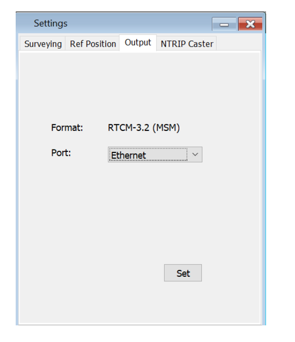
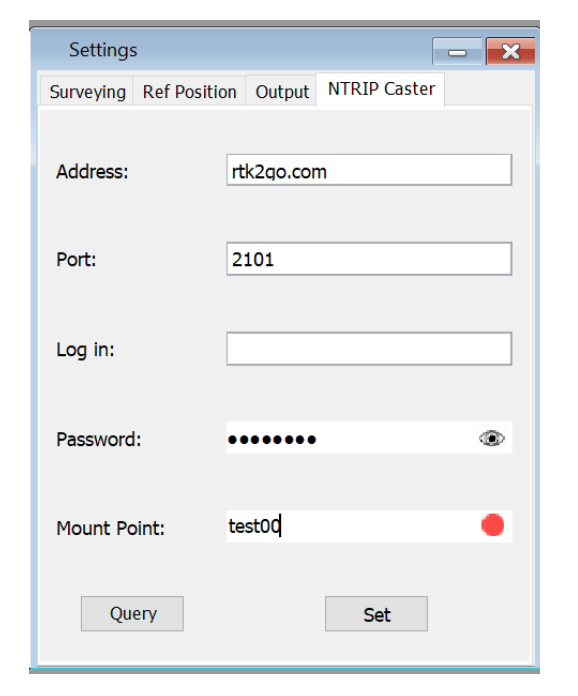

Basestation Guide
==================

1. Introduction
---------------

The INS1000 GNSS Base Station is a ruggedized dual-frequency (L1/L2) multi-constellation GNSS (GPS, QZSS, GLONASS, Beidou, Galileo) reference station which can be easily configured as a local base station to broadcast real-time RTCM corrections for any RTK-capable rover systems. User-friendly GUI is available to setup a base station quickly by either connecting to the rover through local radio link or NTRIP caster/client (network RTK). The system can also record all tracked dual frequency multi-constellation measurements for post- processing.

2. Setting Up the Base Station
------------------------------

.. image:: media/base/base_connectors.png  
    :align: center
    :scale: 50%

To properly operate the Base Station the following ports must be connected in the correct locations.  See the picture above.

- Antenna to antenna port
- COM-PORT1 Cable to PC
- Power/Ethernet Cable to Power.

The antenna should be mounted to an outdoor location such as roof with clear sky view.  

.. note::

    The Power/Ethernet cable connector has a red mark on it.  Match the red dot to the red mark on the mating connector shell.  To remove the cable just pull back lightly on the connector shell.

3. Configuration
----------------
This section give you insight on configuring the INS1000 Base Station Software. The first steps provide calibration information, real-time calculations, and different viewing options. It will go over all the settings, viewing options, and tools in the software. It also includes exporting information for further data analysis. For the Set Up to run smoothly, please read carefully and follow along the User Guide.

3.1 Configure
~~~~~~~~~~~~~

Locate the GNSS basestation software.

- Run “pGnssBase.jar” software.
- Open “Com Port Settings” Window.

    -  Click [Refresh] button
    -  Select the corresponding COMPORT from the drop-down tab. 
    -  Click [Connect] button.

.. image:: media/base/connect.png
    :align: center
    :scale: 50%

- Click [Surveying] Tab
- Check/Click [Average Position]
- Wait until the count reaches the desired Avg. time (recommend at least 300 counts ~= 5min)
- Unclick/Uncheck [Average Position] 
- Click [Copy to ref Position] Button

.. image:: media/base/config.png
    :align: center
    :scale: 50%

- On Settings window, switch to [Ref Position] tab, previous surveying position will show up here.
- Click [Set] button to send the position to base station receiver.
- Click [Query] button to double check or check the current position stored inside the base station receiver.

- On Settings window, switch to [Output] tab,
- Click [Set] once to setup broadcast correct message format for RTK rover.
 
    - This step only need to be done once when the base station is first setup or the format has to be changed

- On Settings window, switch to “NTRIP Caster” tab.
- After filling in the server host information, Click [Set] button.
- You can also Click [Query] button to check the currentserver host information stored inside the base station receiver through the Ethernet/Modem
  

.. note::

    When the base station has successfully connected to the server and started to stream the correction message, the red spot next to the “Mount Point” will turn into green color.

3.2 Sky View
~~~~~~~~~~~~

Sky View shows the distribution of satellites in real time based on the elevation and azimuth.

To view Satellite details:

1. Double Click one satellite and it shows the elevation and azimuth information.
2. Click that satellite and it the elevation and azimuth information will disappear.

3.3 Position View
~~~~~~~~~~~~~~~~~

Shows the current position after opening the Position View.

1. After clicking the [Average Position] checkbox in [Settings] -> [Surveying] Position View also shows the average position in real time.
2. Average Position is represented with a yellow square within the graph.

.. image:: media/base/positionview.png
    :align: center
    :scale: 50%

3.4 Export data
~~~~~~~~~~~~~~~

Export data allows you to save a log file of the Base Station.

1. Choose a directory to save the log file of Base Station and then click [Start Export].
2. Then Click [Stop Export] to finish the completed Export.

