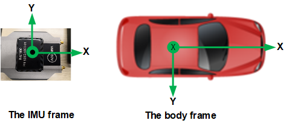
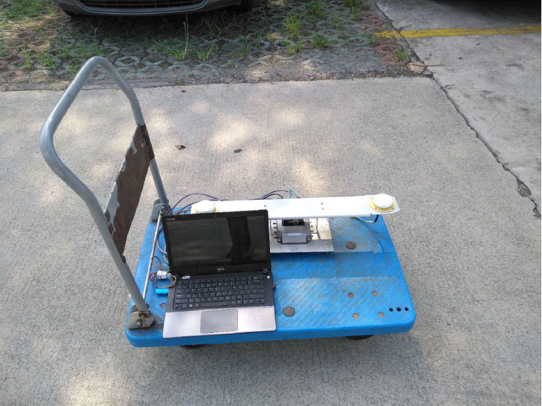

Reference Manual
=================

1. Introduction
------------------------

INS1000 is an integrated navigation system consisting of an inertial measurement unit (IMU) and other sensors. Thus it can output continuously the position, velocity and attitude information of the vehicle. A dual-antenna GNSS receiver is used as the primary aiding sensor. Also supported is a distance measurement indicator (DMI) which can be attached to a wheel of the vehicle/robot to measure the rotation rate of the wheel. Integration of a DMI would give an improved solution in challenging environments: urban canyons, tunnels or indoor. This document explains how to use the system.

2. The IMU Frame and the Body Frame 
------------------------------------
The IMU frame is the frame in which the IMU’s measurement output is generated. The direction of the axes of an IMU can be identified using the accelerometer signal. When an accelerometer is placed in upward direction on a level surface, its output should be approximately 9.8 :math:`m/s^{2}`.On the other hand, if it is place in downward direction, the output should be -9.8 :math:`m/s^{2}`. The positive direction of all three axes of an IMU can be identified this way.

The body frame is the frame in which the inertial navigation solution is generated. The center of the IMU frame coincides with that of the body frame. However, there can be differences in the attitude between the two frames due to physical limitations in the installation of the IMU. For a vehicle, the forward-right-down is typically the body frame of choice. Thus, there will be a rotation matrix :math:`C_{IMU}^{b}` to transform the IMU measurements to the body frame and, for the example below, it is written as

.. math::
    C_{IMU}^{b} = \begin{bmatrix}
    c_{11}& c_{12} & c_{13} \\ 
    c_{21}& c_{22} & c_{23}\\ 
    c_{31}& c_{32} & c_{33}
    \end{bmatrix}=\begin{bmatrix}
    1 & 0 & 0\\ 
    0 & -1 & 0 \\ 
    0 & 0 & -1
    \end{bmatrix}

   Figure 1: The IMU frame and the body frame

+----------+----------+----------+--------------------------+
| IMU X    | IMU Y    | IMU Z    | Transformation Matrix    |
+==========+==========+==========+==========================+
| Forward  | Right    | Down     | [1,0,0; 0,1,0; 0,0,1]    |
+----------+----------+----------+--------------------------+
| Forward  | Left     | Up       | [1,0,0; 0,-1,0; 0,0,-1]  |
+----------+----------+----------+--------------------------+
| Forward  | Down     | Left     | [1,0,0; 0,0,-1; 0,1,0]   |
+----------+----------+----------+--------------------------+
| Forward  | Up       | Right    | [1,0,0; 0,0,1; 0,-1,0]   |
+----------+----------+----------+--------------------------+
| Backward | Left     | Down     | [-1,0,0; 0,-1,0; 0,0,1]  |
+----------+----------+----------+--------------------------+
| Backward | Right    | Up       | [-1,0,0; 0,1,0; 0,0,-1]  |
+----------+----------+----------+--------------------------+
| Backward | Up       | Left     | [-1,0,0; 0,0,-1; 0,-1,0] |
+----------+----------+----------+--------------------------+
| Backward | Down     | Right    | [-1,0,0; 0,0,1; 0,1,0]   |
+----------+----------+----------+--------------------------+
| Right    | Backward | Down     | [0,-1,0; 1,0,0; 0,0,1]   |
+----------+----------+----------+--------------------------+
| Right    | Forward  | Up       | [0,1,0; 1,0,0; 0,0,-1]   |
+----------+----------+----------+--------------------------+
| Right    | Up       | Backward | [0,0,-1; 1,0,0; 0,-1,0]  |
+----------+----------+----------+--------------------------+
| Right    | Down     | Forward  | [0,0,1; 1,0,0; 0,1,0]    |
+----------+----------+----------+--------------------------+
| Left     | Forward  | Down     | [0,1,0; -1,0,0; 0,0,1]   |
+----------+----------+----------+--------------------------+
| Left     | Backward | Up       | [0,-1,0; -1,0,0; 0,0,-1] |
+----------+----------+----------+--------------------------+
| Left     | Up       | Forward  | [0,0,1; -1,0,0; 0,-1,0]  |
+----------+----------+----------+--------------------------+
| Left     | Down     | Backward | [0,0,-1; -1,0,0; 0,1,0]  |
+----------+----------+----------+--------------------------+
| Up       | Forward  | Left     | [0,1,0; 0,0,-1; -1,0,0]  |
+----------+----------+----------+--------------------------+
| Up       | Backward | Right    | [0,-1,0; 0,0,1; -1,0,0]  |
+----------+----------+----------+--------------------------+
| Up       | Right    | Forward  | [0,0,1; 0,1,0; -1,0,0]   |
+----------+----------+----------+--------------------------+
| Up       | Left     | Backward | [0,0,-1; 0,-1,0; -1,0,0] |
+----------+----------+----------+--------------------------+
| Down     | Forward  | Right    | [0,1,0; 0,0,1; 1,0,0]    |
+----------+----------+----------+--------------------------+
| Down     | Backward | Left     | [0,-1,0; 0,0,-1; 1,0,0]  |
+----------+----------+----------+--------------------------+
| Down     | Left     | Forward  | [0,0,1; 0,-1,0; 1,0,0]   |
+----------+----------+----------+--------------------------+
| Down     | Right    | Backward | [0,0,-1; 0,1,0; 1,0,0]   |
+----------+----------+----------+--------------------------+
  Table 1: List of IMU to body frame transformation matrices

3. Measuring Lever Arm
------------------------

The lever-arm is the relative position of other sensors from the center of the IMU. To make the measurement process easier, we make a cross-mark on top of the IMU housing and publishes the vector from the center of the IMU to the mark, :math:`l_{I}^{IMU}`, which is called the internal lever-arm. Thus users can measure the relative position from the cross-mark to other sensors which is referred to as the external lever-arm in the body frame, :math:`l_{E}^{b}`. Therefore, the total lever-arm vector is computed as follows:

.. math::
    C_{IMU}^{b}l_{I}^{IMU}+l_{E}^{b}

The following methods can be used to precisely measure the lever-arms:

- Computer Aided Design (CAD) Software
- Close-range Photogrammetry
- Precision Surveying using total stations or theodolites together with GNSS

4. NTRIP Client 
------------------------

A base station can send out RTCM messages to support the RTK, which enables cm-level positioning accuracy. Networked Transport of RTCM via Internet Protocol (NTRIP) is a protocol to stream the RTCM data over the internet. The user can configure the NTRIP client settings using the control software.

5. User ICD Messages
------------------------

As shown in Figure 2, all ICD messages are composed of header, payload and checksum parts. The header's size is 6 bytes containing 2 sync bytes, message ID, message sub-ID and payload length.

+---------------------+---------+---------------------+
| Header (6 bytes)    | Payload | CheckSum (2 bytes)  |
+---------------------+---------+---------------------+
    Figure 2: Message structure

The checksum shall be computed over the payload part using the Fletcher-16 algorithm as below sample code. Note that all multi-byte entries are written in little-endian format.

.. code-block:: c++
    :linenos:

    checksum_A = checksum_B = 0;
    for (i = 0; i < payload_length; ++i)
    {
        checksum_A += payload[i];
        checksum_B += checksum_A;
    }

5.1. Kalman Filter Navigation Message (1 Hz) 
~~~~~~~~~~~~~~~~~~~~~~~~~~~~~~~~~~~~~~~~~~~~~~~~~

This message is an output of the navigation message at the center of the IMU in 1 Hz synchronized with the GNSS measurements. If the inertial navigator is not running, however, this message contains GNSS-only solutions of the primary GNSS antenna.

+-------+----------+------------------------------------+--------------------------------+
| Field | Type     | Description                        | Content                        |
+=======+==========+====================================+================================+
| 1     | uint8_t  | Sync 1                             | 0xAF                           |
+-------+----------+------------------------------------+--------------------------------+
| 2     | uint8_t  | Sync 2                             | 0x20                           |
+-------+----------+------------------------------------+--------------------------------+
| 3     | uint8_t  | Message type                       | 0x05                           |
+-------+----------+------------------------------------+--------------------------------+
| 4     | uint8_t  | Message sub-ID                     | 0x01                           |
+-------+----------+------------------------------------+--------------------------------+
| 5     | uint16_t | Payload length                     | 91                             |
+-------+----------+------------------------------------+--------------------------------+
| 6     | double   | System time                        | seconds                        |
+-------+----------+------------------------------------+--------------------------------+
| 7     | double   | GPS time; see Note 1               | seconds                        |
+-------+----------+------------------------------------+--------------------------------+
| 8     | double   | Latitude                           | radians                        |
+-------+----------+------------------------------------+--------------------------------+
| 9     | double   | Longitude                          | radians                        |
+-------+----------+------------------------------------+--------------------------------+
| 10    | double   | Ellipsoidal height                 | m                              |
+-------+----------+------------------------------------+--------------------------------+
| 11    | double   | Velocity in north                  | m/s                            |
+-------+----------+------------------------------------+--------------------------------+
| 12    | double   | Velocity in east                   | m/s                            |
+-------+----------+------------------------------------+--------------------------------+
| 13    | double   | Velocity in down                   | m/s                            |
+-------+----------+------------------------------------+--------------------------------+
| 14    | double   | Roll, rotation about the x-axis    | radians                        |
+-------+----------+------------------------------------+--------------------------------+
| 15    | double   | Pitch, rotation about the y-axis   | radians                        |
+-------+----------+------------------------------------+--------------------------------+
| 16    | double   | Heading, rotation about the z-axis | radians                        |
+-------+----------+------------------------------------+--------------------------------+
| 17    | uint8_t  | Position mode                      | See Note 2                     |
+-------+----------+------------------------------------+--------------------------------+
| 18    | uint8_t  | Velocity mode                      | See Note 2                     |
+-------+----------+------------------------------------+--------------------------------+
| 19    | uint8_t  | Attitude status                    | 0: Invalid, 1: Coarse, 2: Fine |
+-------+----------+------------------------------------+--------------------------------+
| 20    | uint8_t  | Checksum A                         |                                |
+-------+----------+------------------------------------+--------------------------------+
| 21    | uint8_t  | Checksum B                         |                                |
+-------+----------+------------------------------------+--------------------------------+

.. note::
    1. GPS seconds since starting week; thus this will not rollover after 604800.
    #. Position and velocity mode are defined as follows:
        - 0: Invalid,
        - 1: Dead-reckoning (navigating with inertial measurements only),
        - 2: Stand-alone (autonomous or single point positioning),
        - 3: Precise point positioning (using precise ephemeris data)
        - 4: Code differential (using code-corrections from base stations or SBAS)
        - 5: RTK float
        - 6: RTK fixed
        - 7: User aiding (aiding by the user input)

5.2. Satellite Signal Strength 
~~~~~~~~~~~~~~~~~~~~~~~~~~~~~~~~~~~~~~~~~~~~~~~~~

This message delivers the satellite signal strength information obtained from the GNSS observable.

+-------+----------+-----------------------------+-----------------------+
| Field | Type     | Description                 | Content               |
+=======+==========+=============================+=======================+
| 1     | uint8_t  | Sync 1                      | 0xAF                  |
+-------+----------+-----------------------------+-----------------------+
| 2     | uint8_t  | Sync 2                      | 0x20                  |
+-------+----------+-----------------------------+-----------------------+
| 3     | uint8_t  | Message type                | 0x05                  |
+-------+----------+-----------------------------+-----------------------+
| 4     | uint8_t  | Message sub-ID              | 0x02                  |
+-------+----------+-----------------------------+-----------------------+
| 5     | uint16_t | Payload length              | 19 + N_SV * 10        |
+-------+----------+-----------------------------+-----------------------+
| 6     | double   | System time                 | seconds               |
+-------+----------+-----------------------------+-----------------------+
| 7     | double   | GPS time                    |                       |
+-------+----------+-----------------------------+-----------------------+
| 8     | uint8_t  | Receiver ID                 |                       |
+-------+----------+-----------------------------+-----------------------+
| 9     | uint8_t  | Antenna ID                  |                       |
+-------+----------+-----------------------------+-----------------------+
| 10    | uint8_t  | Number of satellites (N_SV) |                       |
+-------+----------+-----------------------------+-----------------------+
| 11    | uint8_t  | SV system; see Note 1       | First satellite data  |
+-------+----------+-----------------------------+-----------------------|
| 12    | uint8_t  | SVID; see Note 2            |                       |
+-------+----------+-----------------------------+-----------------------|
| 13    | float    | L1 C/N0 (dB-Hz)             |                       |
+-------+----------+-----------------------------+-----------------------|
| 14    | float    | L2 C/N0 (dB-Hz)             |                       |
+-------+----------+-----------------------------+-----------------------+
| 15    | uint8_t  | SV system                   | Second satellite data |
+-------+----------+-----------------------------+-----------------------|
| 16    | uint8_t  | SVID                        |                       |
+-------+----------+-----------------------------+-----------------------|
| 17    | float    | L1 C/N0 (dB-Hz)             |                       |
+-------+----------+-----------------------------+-----------------------|
| 18    | float    | L2 C/N0 (dB-Hz)             |                       |
+-------+----------+-----------------------------+-----------------------+
| ...   |          |                             |                       |
+-------+----------+-----------------------------+-----------------------+
|       | uint8_t  |    Checksum A               |                       |
+-------+----------+-----------------------------+-----------------------+
|       | uint8_t  |     Checksum B              |                       |
+-------+----------+-----------------------------+-----------------------+

.. note::
    1. 0: GPS, 1: GLONASS, 2: Galileo, 3: QZSS, 4: Beidou, 5: SBAS
    #. SVID is the unique satellite number used in each satellite system; for GPS it is the PRN number and for GLONASS it is the SLOT number.

5.3. SV Visibility 
~~~~~~~~~~~~~~~~~~~~~~~~~~~~~~~~~~~~~~~~~~~~~~~~~
+-------+----------+-----------------+-----------------------+
| Field | Type     | Description     | Content               |
+=======+==========+=================+=======================+
| 1     | uint8_t  | Sync 1          | 0xAF                  |
+-------+----------+-----------------+-----------------------+
| 2     | uint8_t  | Sync 2          | 0x20                  |
+-------+----------+-----------------+-----------------------+
| 3     | uint8_t  | Message type    | 0x05                  |
+-------+----------+-----------------+-----------------------+
| 4     | uint8_t  | Message sub-ID  | 0x03                  |
+-------+----------+-----------------+-----------------------+
| 5     | uint16_t | Payload length  | 18 + N_SV * 10        |
+-------+----------+-----------------+-----------------------+
| 6     | double   | System time     | seconds               |
+-------+----------+-----------------+-----------------------+
| 7     | double   | GPS time        | seconds               |
+-------+----------+-----------------+-----------------------+
| 8     | uint8_t  | Receiver number |                       |
+-------+----------+-----------------+-----------------------+
| 9     | uint8_t  | N_SV            | Number of SV data     |
+-------+----------+-----------------+-----------------------+
| 10    | uint8_t  | SV system       | First satellite data  |
+-------+----------+-----------------+-----------------------|
| 11    | uint8_t  | SVID            |                       |
+-------+----------+-----------------+-----------------------|
| 12    | float    | Azimuth (deg)   |                       |
+-------+----------+-----------------+-----------------------|
| 13    | float    | Elevation (deg) |                       |
+-------+----------+-----------------+-----------------------+
| 14    | uint8_t  | SV system       | Second satellite data |
+-------+----------+-----------------+-----------------------|
| 15    | uint8_t  | SVID            |                       |
+-------+----------+-----------------+-----------------------|
| 16    | float    | Azimuth (deg)   |                       |
+-------+----------+-----------------+-----------------------|
| 17    | float    | Elevation (deg) |                       |
+-------+----------+-----------------+-----------------------+
| ...   |          |                 |                       |
+-------+----------+-----------------+-----------------------+
|       | uint8_t  | Checksum A      |                       |
+-------+----------+-----------------+-----------------------+
|       | uint8_t  | Checksum B      |                       |
+-------+----------+-----------------+-----------------------+

5.4. Install Parameters 
~~~~~~~~~~~~~~~~~~~~~~~~~~~~~~~~~~~~~~~~~~~~~~~~~

+-------+--------------+-----------------------------------+--------------------+
| Field | Type         | Description                       | Content            |
+=======+==============+===================================+====================+
| 1     | uint8_t      | Sync 1                            | 0xAF               |
+-------+--------------+-----------------------------------+--------------------+
| 2     | uint8_t      | Sync 2                            | 0x20               |
+-------+--------------+-----------------------------------+--------------------+
| 3     | uint8_t      | Message type                      | 0x05               |
+-------+--------------+-----------------------------------+--------------------+
| 4     | uint8_t      | Message sub-ID                    | 0x04               |
+-------+--------------+-----------------------------------+--------------------+
| 5     | uint16_t     | Payload length                    | 72+N_ANT*32        |
+-------+--------------+-----------------------------------+--------------------+
| 6     | double[3][3] | IMU axes transformation matrix    |                    |
+-------+--------------+-----------------------------------+--------------------+
| 7     | uint8_t      | N_ANT                             | Number of antennas |
+-------+--------------+-----------------------------------+--------------------+
| 8     | double[3]    | Lever-arm vector of 1st antenna   | m                  |
+-------+--------------+-----------------------------------+--------------------+
| 9     | double       | Lever-arm variance of 1st antenna | :math:`m^{2}`      |
+-------+--------------+-----------------------------------+--------------------+
| 10    | double[3]    | Lever-arm vector of 2nd antenna   | m                  |
+-------+--------------+-----------------------------------+--------------------+
| 11    | double       | Lever-arm variance of 2nd antenna | :math:`m^{2}`      |
+-------+--------------+-----------------------------------+--------------------+
| …     |              |                                   |                    |
+-------+--------------+-----------------------------------+--------------------+
|       | uint8_t      | Checksum A                        |                    |
+-------+--------------+-----------------------------------+--------------------+
|       | uint8_t      | Checksum B                        |                    |
+-------+--------------+-----------------------------------+--------------------+

5.5. Nav Uncertainty Message
~~~~~~~~~~~~~~~~~~~~~~~~~~~~~~~~~~~~~~~~~~~~~~~~~
+-------+----------+----------------+---------+
| Field | Type     | Description    | Content |
+=======+==========+================+=========+
| 1     | uint8_t  | Sync 1         | 0xAF    |
+-------+----------+----------------+---------+
| 2     | uint8_t  | Sync 2         | 0x20    |
+-------+----------+----------------+---------+
| 3     | uint8_t  | Message type   | 0x05    |
+-------+----------+----------------+---------+
| 4     | uint8_t  | Message sub-ID | 0x05    |
+-------+----------+----------------+---------+
| 5     | uint16_t | Payload length | 32      |
+-------+----------+----------------+---------+
| 6     | double   | System time    | seconds |
+-------+----------+----------------+---------+
| 7     | double   | Position RMS   | m       |
+-------+----------+----------------+---------+
| 8     | double   | Velocity RMS   | m/s     |
+-------+----------+----------------+---------+
| 9     | double   | Attitude RMS   | deg     |
+-------+----------+----------------+---------+
| 10    | uint8_t  | Checksum A     |         |
+-------+----------+----------------+---------+
| 11    | uint8_t  | Checksum B     |         |
+-------+----------+----------------+---------+

5.6. Product ID Message
~~~~~~~~~~~~~~~~~~~~~~~~~~~~~~~~~~~~~~~~~~~~~~~~~

This message contains the identification number of the product. To receive this message send the message defined in Section 8.1.

+-------+----------+----------------+---------+
| Field | Type     | Description    | Content |
+=======+==========+================+=========+
| 1     | uint8_t  | Sync 1         | 0xAF    |
+-------+----------+----------------+---------+
| 2     | uint8_t  | Sync 2         | 0x20    |
+-------+----------+----------------+---------+
| 3     | uint8_t  | Message type   | 0x05    |
+-------+----------+----------------+---------+
| 4     | uint8_t  | Message sub-ID | 0x06    |
+-------+----------+----------------+---------+
| 5     | uint16_t | Payload length | 2       |
+-------+----------+----------------+---------+
| 6     | uint16_t | Product ID     |         |
+-------+----------+----------------+---------+
| 7     | uint8_t  | Checksum A     |         |
+-------+----------+----------------+---------+
| 8     | uint8_t  | Checksum B     |         |
+-------+----------+----------------+---------+

5.7. Navigation Data Message (High Rate) 
~~~~~~~~~~~~~~~~~~~~~~~~~~~~~~~~~~~~~~~~~~~~~~~~~
+-------+-----------+---------------------------------+----------------------------+
| Field | Type      | Description                     | Content                    |
+=======+===========+=================================+============================+
| 1     | uint8_t   | Sync 1                          | 0xAF                       |
+-------+-----------+---------------------------------+----------------------------+
| 2     | uint8_t   | Sync 2                          | 0x20                       |
+-------+-----------+---------------------------------+----------------------------+
| 3     | uint8_t   | Message type                    | 0x05                       |
+-------+-----------+---------------------------------+----------------------------+
| 4     | uint8_t   | Message sub-ID                  | 0x07                       |
+-------+-----------+---------------------------------+----------------------------+
| 5     | uint16_t  | Payload length                  | 99                         |
+-------+-----------+---------------------------------+----------------------------+
| 6     | double    | System time                     | seconds                    |
+-------+-----------+---------------------------------+----------------------------+
| 7     | double    | GPS time of week                | seconds                    |
+-------+-----------+---------------------------------+----------------------------+
| 8     | double    | Latitude                        | deg                        |
+-------+-----------+---------------------------------+----------------------------+
| 9     | double    | Longitude                       | deg                        |
+-------+-----------+---------------------------------+----------------------------+
| 10    | double    | Ellipsoidal height              | m                          |
+-------+-----------+---------------------------------+----------------------------+
| 11    | double[3] | Velocity in NED                 | m/s                        |
+-------+-----------+---------------------------------+----------------------------+
| 12    | double[4] | Body to NED attitude quaternion | See Note 1 in Section 6.13 |
+-------+-----------+---------------------------------+----------------------------+
| 13    | uint8_t   | Alignment mode                  |                            |
+-------+-----------+---------------------------------+----------------------------+
| 14    | uint16_t  | GPS week number                 |                            |
+-------+-----------+---------------------------------+----------------------------+
| 15    | uint8_t   | Checksum A                      |                            |
+-------+-----------+---------------------------------+----------------------------+
| 16    | uint8_t   | Checksum B                      |                            |
+-------+-----------+---------------------------------+----------------------------+

5.8. Scaled Raw IMU Data
~~~~~~~~~~~~~~~~~~~~~~~~~~~~~~~~~~~~~~~~~~~~~~~~~

This message contains scaled raw IMU data. The reference frame of this data is the IMU frame.

+-------+-----------+----------------+-----------------+
| Field | Type      | Description    | Content         |
+=======+===========+================+=================+
| 1     | uint8_t   | Sync 1         | 0xAF            |
+-------+-----------+----------------+-----------------+
| 2     | uint8_t   | Sync 2         | 0x20            |
+-------+-----------+----------------+-----------------+
| 3     | uint8_t   | Message type   | 0x05            |
+-------+-----------+----------------+-----------------+
| 4     | uint8_t   | Message sub-ID | 0x08            |
+-------+-----------+----------------+-----------------+
| 5     | uint16_t  | Payload length | 56              |
+-------+-----------+----------------+-----------------+
| 6     | double    | System time    | seconds         |
+-------+-----------+----------------+-----------------+
| 7     | double[3] | Acceleration   | :math:`m/s^{2}` |
+-------+-----------+----------------+-----------------+
| 8     | double[3] | Rotation rate  | degrees/s       |
+-------+-----------+----------------+-----------------+
| 9     | uint8_t   | Checksum A     |                 |
+-------+-----------+----------------+-----------------+
| 10    | uint8_t   | Checksum B     |                 |
+-------+-----------+----------------+-----------------+

5.9. Solution Status (1 Hz)
~~~~~~~~~~~~~~~~~~~~~~~~~~~~~~~~~~~~~~~~~~~~~~~~~

This message shows the Kalman filter solution status. The RMS of the position, velocity and attitude is the squre-root of the diagonal elements of the covariance matrix of the Kalman filter.

+-------+-----------+-------------------------------------------------+---------+
| Field | Type      | Description                                     | Content |
+=======+===========+=================================================+=========+
| 1     | uint8_t   | Sync 1                                          | 0xAF    |
+-------+-----------+-------------------------------------------------+---------+
| 2     | uint8_t   | Sync 2                                          | 0x20    |
+-------+-----------+-------------------------------------------------+---------+
| 3     | uint8_t   | Message type                                    | 0x05    |
+-------+-----------+-------------------------------------------------+---------+
| 4     | uint8_t   | Message sub-ID                                  | 0x09    |
+-------+-----------+-------------------------------------------------+---------+
| 5     | uint16_t  | Payload length                                  | 92      |
+-------+-----------+-------------------------------------------------+---------+
| 6     | double    | System time                                     | seconds |
+-------+-----------+-------------------------------------------------+---------+
| 7     | uint8_t   | Number of SVs used                              |         |
+-------+-----------+-------------------------------------------------+---------+
| 8     | uint8_t   | Processing mode                                 |         |
+-------+-----------+-------------------------------------------------+---------+
| 9     | uint16_t  | GPS week number; if 0 time is not synced to GPS |         |
+-------+-----------+-------------------------------------------------+---------+
| 10    | double    | GPS time of week                                | seconds |
+-------+-----------+-------------------------------------------------+---------+
| 11    | double[3] | Position RMS (NED)                              | m       |
+-------+-----------+-------------------------------------------------+---------+
| 12    | double[3] | Velocity RMS (NED)                              | m/s     |
+-------+-----------+-------------------------------------------------+---------+
| 13    | double[3] | Attitude RMS (NED)                              | deg     |
+-------+-----------+-------------------------------------------------+---------+
| 14    | uint8_t   | Checksum A                                      |         |
+-------+-----------+-------------------------------------------------+---------+
| 15    | uint8_t   | Checksum B                                      |         |
+-------+-----------+-------------------------------------------------+---------+

5.10. Repackaged GSV Message
~~~~~~~~~~~~~~~~~~~~~~~~~~~~~~~~~~~~~~~~~~~~~~~~~

This is a repackaged NMEA GSV message generated by the receiver.

+-----------+-------------+-----------------+----------------------+
| Field     | Type        | Description     | Content              |
+===========+=============+=================+======================+
| 1         | uint8_t     | Sync 1          | 0xAF                 |
+-----------+-------------+-----------------+----------------------+
| 2         | uint8_t     | Sync 2          | 0x20                 |
+-----------+-------------+-----------------+----------------------+
| 3         | uint8_t     | Message type    | 0x05                 |
+-----------+-------------+-----------------+----------------------+
| 4         | uint8_t     | Message sub-ID  | 0x0A                 |
+-----------+-------------+-----------------+----------------------+
| 5         | uint16_t    | Payload length  | length 12 + N_SV * 5 |
+-----------+-------------+-----------------+----------------------+
| 6         | double      | System time     | seconds              |
+-----------+-------------+-----------------+----------------------+
| 7         | uint8_t     | Receiver number |                      |
+-----------+-------------+-----------------+----------------------+
| 8         | uint8_t     | Antenna ID      |                      |
+-----------+-------------+-----------------+----------------------+
| 9         | uint8_t     | SV system       |                      |
+-----------+-------------+-----------------+----------------------+
| 10        | uint8_t     | N_SV            |                      |
+-----------+-------------+-----------------+----------------------+
| 11        | uint8_t     | SVID            | SVID of 1st SV       |
+-----------+-------------+-----------------+----------------------+
| 12        | uint8_t     | Elevation       | deg                  |
+-----------+-------------+-----------------+----------------------+
| 13        | uint16_t    | Azimuth         | deg                  |
+-----------+-------------+-----------------+----------------------+
| 14        | uint8_t     | SNR             | db-Hz                |
+-----------+-------------+-----------------+----------------------+
| 15        | uint8_t     | SVID            | SVID of 2nd SV       |
+-----------+-------------+-----------------+----------------------+
| 16        | uint8_t     | Elevation       | deg                  |
+-----------+-------------+-----------------+----------------------+
| 17        | uint16_t    | Azimuth         | deg                  |
+-----------+-------------+-----------------+----------------------+
| 18        | uint8_t     | SNR             | db-Hz                |
+-----------+-------------+-----------------+----------------------+
| ...       |             |                 |                      |
+-----------+-------------+-----------------+----------------------+
|           | uint8_t     | Checksum A      |                      |
+-----------+-------------+-----------------+----------------------+
|           | uint8_t     | Checksum B      |                      |
+-----------+-------------+-----------------+----------------------+

5.11. Vehicle Dynamics Message
~~~~~~~~~~~~~~~~~~~~~~~~~~~~~~~~~~~~~~~~~~~~~~~~~

+-------+-----------+--------------------------------------------------------+---------+
| Field | Type      | Description                                            | Content |
+=======+===========+========================================================+=========+
| 1     | uint8_t   | Sync 1                                                 | 0xAF    |
+-------+-----------+--------------------------------------------------------+---------+
| 2     | uint8_t   | Sync 2                                                 | 0x20    |
+-------+-----------+--------------------------------------------------------+---------+
| 3     | uint8_t   | Message type                                           | 0x05    |
+-------+-----------+--------------------------------------------------------+---------+
| 4     | uint8_t   | Message sub-ID                                         | 0x0B    |
+-------+-----------+--------------------------------------------------------+---------+
| 5     | uint16_t  | Payload length                                         | 67      |
+-------+-----------+--------------------------------------------------------+---------+
| 6     | double    | System time                                            | seconds |
+-------+-----------+--------------------------------------------------------+---------+
| 7     | double    | GPS time of week                                       | seconds |
+-------+-----------+--------------------------------------------------------+---------+
| 8     | double[3] | Acceleration in body frame. See Note 2 in Section 5.13 |         |
+-------+-----------+--------------------------------------------------------+---------+
| 9     | double[3] | Rotation rate in body frame. See Note 3 in Section 5.13|         |
+-------+-----------+--------------------------------------------------------+---------+
| 10    | uint16_t  | GPS week number                                        |         |
+-------+-----------+--------------------------------------------------------+---------+
| 11    | uint8_t   | Alignment mode                                         |         |
+-------+-----------+--------------------------------------------------------+---------+
| 12    | uint8_t   | Checksum A                                             |         |
+-------+-----------+--------------------------------------------------------+---------+
| 13    | uint8_t   | Checksum B                                             |         |
+-------+-----------+--------------------------------------------------------+---------+

5.12. Distance Measurement Indicator Data12 
~~~~~~~~~~~~~~~~~~~~~~~~~~~~~~~~~~~~~~~~~~~~~~~~~

+-------+----------+----------------+---------+
| Field | Type     | Description    | Content |
+=======+==========+================+=========+
| 1     | uint8_t  | Sync 1         | 0xAF    |
+-------+----------+----------------+---------+
| 2     | uint8_t  | Sync 2         | 0x20    |
+-------+----------+----------------+---------+
| 3     | uint8_t  | Message type   | 0x05    |
+-------+----------+----------------+---------+
| 4     | uint8_t  | Message sub-ID | 0x0C    |
+-------+----------+----------------+---------+
| 5     | uint16_t | Payload length | 13      |
+-------+----------+----------------+---------+
| 6     | double   | System time    | seconds |
+-------+----------+----------------+---------+
| 7     | int32_t  | Pulse count    |         |
+-------+----------+----------------+---------+
| 8     | uint8_t  | DMI ID         |         |
+-------+----------+----------------+---------+
| 9     | uint8_t  | Checksum A     |         |
+-------+----------+----------------+---------+
| 10    | uint8_t  | Checksum B     |         |
+-------+----------+----------------+---------+

5.13. Compact Navigation Message (High Rate)
~~~~~~~~~~~~~~~~~~~~~~~~~~~~~~~~~~~~~~~~~~~~~~~~~

This message is a high-rate real-time navigation output at the position defined by the user.

+-------+----------+----------------------------------------------------+--------------------------------+
| Field | Type     | Description                                        | Content                        |
+=======+==========+====================================================+================================+
| 1     | uint8_t  | Sync 1                                             | 0xAF                           |
+-------+----------+----------------------------------------------------+--------------------------------+
| 2     | uint8_t  | Sync 2                                             | 0x20                           |
+-------+----------+----------------------------------------------------+--------------------------------+
| 3     | uint8_t  | Message type                                       | 0x05                           |
+-------+----------+----------------------------------------------------+--------------------------------+
| 4     | uint8_t  | Message sub-ID                                     | 0x0D                           |
+-------+----------+----------------------------------------------------+--------------------------------+
| 5     | uint16_t | Payload length                                     | 119                            |
+-------+----------+----------------------------------------------------+--------------------------------+
| 6     | double   | System time if week = 0, otherwise GPS timeof week | seconds                        |
+-------+----------+----------------------------------------------------+--------------------------------+
| 7     | double   | Latitude                                           | degrees                        |
+-------+----------+----------------------------------------------------+--------------------------------+
| 8     | double   | Longitude                                          | degrees                        |
+-------+----------+----------------------------------------------------+--------------------------------+
| 9     | float    | Ellipsoidal height                                 | m                              |
+-------+----------+----------------------------------------------------+--------------------------------+
| 10    | float[3] | Velocity in North, East, Down                      | m/s                            |
+-------+----------+----------------------------------------------------+--------------------------------+
| 11    | float[4] | Attitude quaternion; see Note 1                    | Scalar, X, Y, Z                |
+-------+----------+----------------------------------------------------+--------------------------------+
| 12    | float[3] | Acceleration in body frame; see Note 2             | m/s2                           |
+-------+----------+----------------------------------------------------+--------------------------------+
| 13    | float[3] | Rotation rate in body frame; see Note 3            | degrees/s                      |
+-------+----------+----------------------------------------------------+--------------------------------+
| 14    | float[3] | Position RMS in NED                                | m                              |
+-------+----------+----------------------------------------------------+--------------------------------+
| 15    | float[3] | Velocity RMS in NED                                | m/s                            |
+-------+----------+----------------------------------------------------+--------------------------------+
| 16    | float[3] | Attitude RMS in NED                                | degrees                        |
+-------+----------+----------------------------------------------------+--------------------------------+
| 17    | uint16_t | GPS week number                                    | If 0 time is not synced to GPS |
+-------+----------+----------------------------------------------------+--------------------------------+
| 18    | uint8_t  | Alignment status                                   | 0: Invalid, 1: Coarse, 2: Fine |
+-------+----------+----------------------------------------------------+--------------------------------+
| 19    | uint8_t  | Checksum A                                         |                                |
+-------+----------+----------------------------------------------------+--------------------------------+
| 20    | uint8_t  | Checksum B                                         |                                |
+-------+----------+----------------------------------------------------+--------------------------------+

.. note::
    1. Attitude quaternion for the transformation from the body frame to the NED frame, :math:`q_{b}^{n}`. Note that the quaternion in ROS is defined as (X, Y, Z, scalar). The DCM corresponding to :math:`q_{b}^{n}` can be computed as follows:

    .. math::
        C_{b}^{n} = \begin{bmatrix}
        q_{0}^{2}+ q_{1}^{2}- q_{2}^{2}- q_{3}^{2} & 2(q_{1}q_{2}-q_{0}q_{3})  & 2(q_{1}q_{3}+q_{0}q_{2}) \\ 
        2(q_{1}q_{2}+q_{0}q_{3})&  q_{0}^{2}- q_{1}^{2}+q_{2}^{2}- q_{3}^{2}  & 2(q_{2}q_{3}-q_{0}q_{1})\\ 
        2(q_{1}q_{3}-q_{0}q_{2}) & 2(q_{2}q_{3}+q_{0}q_{1}) &  q_{0}^{2}-q_{1}^{2}- q_{2}^{2}+ q_{3}^{2} 
        \end{bmatrix}

    where :math:`q_{i}` are elements of :math:`q_{b}^{n}`. Let  :math:`C_{b}^{n} = \begin{Bmatrix}c_{ij}\end{Bmatrix}` then if :math:`\begin{vmatrix}c_{31}\end{vmatrix}< 0.9999` the Euler angles can be computed as follows:

    .. math::
        \phi =atan2(c_{32},c_{33})
    .. math::
        \Theta = atan\begin{pmatrix}-c_{31}/\sqrt{c_{32}^{2}+c_{33}^{2}}\end{pmatrix}
    .. math::
        \psi = atan2(c_{21},c_{11})

    where :math:`\phi`, :math:`\Theta` and :math:`\psi` are the roll, pitch and heading, respectively.

    2. Acceleration output is corrected for the gravity, Coriolis force and the estimated accelerometer biases: :math:`f^{b}-b_{a}+C_{e}^{b}(g^{e}-2w_{ie}^{e}\times v^{e} )` where :math:`f^{b}` is the specific force measurement from the IMU, :math:`b_{a}` estimated accelerometer bias, :math:`C_{e}^{b}` the DCM for the transformation from the ECEF to the body frame, :math:`g^{e}` the gravity vector computed from the model, :math:`w_{ie}^{e}` the earth's rotation rate vector, and  :math:`v^{e}` the velocity vector.

    3. Rotation rate output is corrected for the earth rotation rate and the estimated gyro biases, i.e., :math:`w_{ie}^{e}`.

5.14. NMEA PECNM Message
~~~~~~~~~~~~~~~~~~~~~~~~~~~~~~~~~~~~~~~~~~~~~~~~~

This message is NMEA style text message corresponding to the message in Section 5.13.

5.15. NMEA GPRMC Message
~~~~~~~~~~~~~~~~~~~~~~~~~~~~~~~~~~~~~~~~~~~~~~~~~

This is the NMEA GPRMC message generated by the primary GNSS receiver.

5.16. Time Sync Message 
~~~~~~~~~~~~~~~~~~~~~~~~~~~~~~~~~~~~~~~~~~~~~~~~~

This message contains the time sync message between the system time and GPS time. It gets generated at every PPS event. The GPS time corresponding to the system time can be obtained by

  GPS time = System computer time - Bias

+-------+----------+-------------------------------+---------+
| Field | Type     | Description                   | Content |
+=======+==========+===============================+=========+
| 1     | uint8_t  | Sync 1                        | 0xAF    |
+-------+----------+-------------------------------+---------+
| 2     | uint8_t  | Sync 2                        | 0x20    |
+-------+----------+-------------------------------+---------+
| 3     | uint8_t  | Message type                  | 0x05    |
+-------+----------+-------------------------------+---------+
| 4     | uint8_t  | Message sub-ID                | 0x10    |
+-------+----------+-------------------------------+---------+
| 5     | uint16_t | Payload length                | 16      |
+-------+----------+-------------------------------+---------+
| 6     | double   | System computer time          | seconds |
+-------+----------+-------------------------------+---------+
| 7     | double   | Bias with respect to GPS time | seconds |
+-------+----------+-------------------------------+---------+
| 8     | uint8_t  | Checksum A                    |         |
+-------+----------+-------------------------------+---------+
| 9     | uint8_t  | Checksum B                    |         |
+-------+----------+-------------------------------+---------+

5.17. Raw GNSS Data Message
~~~~~~~~~~~~~~~~~~~~~~~~~~~~~~~~~~~~~~~~~~~~~~~~~

This message contains raw data generated by the GNSS receivers.

+-------+------------+----------------------+---------+
| Field | Type       | Description          | Content |
+=======+============+======================+=========+
| 1     | uint8_t    | Sync 1               | 0xAF    |
+-------+------------+----------------------+---------+
| 2     | uint8_t    | Sync 2               | 0x20    |
+-------+------------+----------------------+---------+
| 3     | uint8_t    | Message type         | 0x05    |
+-------+------------+----------------------+---------+
| 4     | uint8_t    | Message sub-ID       | 0x11    |
+-------+------------+----------------------+---------+
| 5     | uint16_t   | Payload length       | 10+N    |
+-------+------------+----------------------+---------+
| 6     | double     | System computer time | seconds |
+-------+------------+----------------------+---------+
| 7     | uint8_t    | Receiver number      |         |
+-------+------------+----------------------+---------+
| 8     | uint8_t    | Receiver type        |         |
+-------+------------+----------------------+---------+
| 9     | uint8_t[N] | Raw GNSS data        |         |
+-------+------------+----------------------+---------+
| 10    | uint8_t    | Checksum A           |         |
+-------+------------+----------------------+---------+
| 11    | uint8_t    | Checksum B           |         |
+-------+------------+----------------------+---------+

5.18. Engine Version Message
~~~~~~~~~~~~~~~~~~~~~~~~~~~~~~~~~~~~~~~~~~~~~~~~~

This message shows the engine version of the system. To receive this message the user needs to send an 8-byte binary message “0xAF 0x02 0x06 0x0B 0x01 0x02 0x02 0x02” to the system.

+-------+----------+-----------------------+---------+
| Field | Type     | Description           | Content |
+=======+==========+=======================+=========+
| 1     | uint8_t  | Sync 1                | 0xAF    |
+-------+----------+-----------------------+---------+
| 2     | uint8_t  | Sync 2                | 0x20    |
+-------+----------+-----------------------+---------+
| 3     | uint8_t  | Message type          | 0x05    |
+-------+----------+-----------------------+---------+
| 4     | uint8_t  | Message sub-ID        | 0x12    |
+-------+----------+-----------------------+---------+
| 5     | uint16_t | Payload length        | N       |
+-------+----------+-----------------------+---------+
| 6     | char[N]  | Engine version string |         |
+-------+----------+-----------------------+---------+
| 7     | uint8_t  | Checksum A            |         |
+-------+----------+-----------------------+---------+
| 8     | uint8_t  | Checksum B            |         |
+-------+----------+-----------------------+---------+

5.19. GNSS Receiver Acknowledge Message 
~~~~~~~~~~~~~~~~~~~~~~~~~~~~~~~~~~~~~~~~~~~~~~~~~

This message shows the acknowledge response from a GNSS receiver.

+-------+----------+-----------------+---------+
| Field | Type     | Description     | Content |
+=======+==========+=================+=========+
| 1     | uint8_t  | Sync 1          | 0xAF    |
+-------+----------+-----------------+---------+
| 2     | uint8_t  | Sync 2          | 0x20    |
+-------+----------+-----------------+---------+
| 3     | uint8_t  | Message type    | 0x05    |
+-------+----------+-----------------+---------+
| 4     | uint8_t  | Message sub-ID  | 0x13    |
+-------+----------+-----------------+---------+
| 5     | uint16_t | Payload length  | 2       |
+-------+----------+-----------------+---------+
| 6     | uint8_t  | Receiver number |         |
+-------+----------+-----------------+---------+
| 7     | uint8_t  | Receiver type   |         |
+-------+----------+-----------------+---------+
| 8     | uint8_t  | Checksum A      |         |
+-------+----------+-----------------+---------+
| 9     | uint8_t  | Checksum B      |         |
+-------+----------+-----------------+---------+

5.20. GNSS Antenna Lever-Arm Calibration Data
~~~~~~~~~~~~~~~~~~~~~~~~~~~~~~~~~~~~~~~~~~~~~~~~~

Although it is recommended to accurately measure the lever-arms, sometimes it is very difficult to measure them. In this case the user can let the system calibrate the lever-arm vector. The calibration, however, must be done in an open-sky area with RTK enabled. For the primary antenna, the trajectory must include frequent turns, up-hill or down-hill driving for a considerably long time (one hour or more). Thus it would be the best to measure precisely with other instruments. Also the dual-antenna solution cannot be used in the solution during the calibration mode. So the INS initialization must be done with GNSS velocity.

+-------+-----------+--------------------------------+--------------------+
| Field | Type      | Description                    | Content            |
+=======+===========+================================+====================+
| 1     | uint8_t   | Sync 1                         | 0xAF               |
+-------+-----------+--------------------------------+--------------------+
| 2     | uint8_t   | Sync 2                         | 0x20               |
+-------+-----------+--------------------------------+--------------------+
| 3     | uint8_t   | Message type                   | 0x05               |
+-------+-----------+--------------------------------+--------------------+
| 4     | uint8_t   | Message sub-ID                 | 0x14               |
+-------+-----------+--------------------------------+--------------------+
| 5     | uint16_t  | Payload length                 | 57                 |
+-------+-----------+--------------------------------+--------------------+
| 6     | double    | Internal computer time         | seconds            |
+-------+-----------+--------------------------------+--------------------+
| 7     | double[3] | Lever arm vector in body frame |                    |
+-------+-----------+--------------------------------+--------------------+
| 8     | double[3] | Variance                       | m2                 |
+-------+-----------+--------------------------------+--------------------+
| 9     | uint8_t   | Antenna indicator; see Note 1  | 0: pri, 1: sec-pri |
+-------+-----------+--------------------------------+--------------------+
| 10    | uint8_t   | Checksum A                     |                    |
+-------+-----------+--------------------------------+--------------------+
| 11    | uint8_t   | Checksum B                     |                    |
+-------+-----------+--------------------------------+--------------------+

.. note::
    1. When antenna indicator is '1' the message outputs the vector from the primary to the secondary antenna in the body frame. To get the lever-arm of the secondary antenna, the primary lever-arm vector must be added. Shown in Figure is a plot of this message for a lever-arm of the secondary antenna with respect to the primary antenna. It is recommended to take the mean values after the convergence.

    .. figure:: media/ref/Example_of_a_lever-arm_calibration.png
        :scale: 100 %
        :align: center

        Figure 4: The IMU frame and the body frame

5.21. DMI Lever-Arm Calibration Data 
~~~~~~~~~~~~~~~~~~~~~~~~~~~~~~~~~~~~~~~~~~~~~~~~~

TBD.

5.22. Geoid Height 
~~~~~~~~~~~~~~~~~~~~~~~~~~~~~~~~~~~~~~~~~~~~~~~~~

This message outputs the Geoid height, which is the height of Geoid above the ellipsoid. The height above Geoid, treated normally as the height above mean sea level (MSL), can be computed as follows:

  Height above MSL = Height above ellipsoid - Geoid height

+-------+----------+----------------+---------+
| Field | Type     | Description    | Content |
+=======+==========+================+=========+
| 1     | uint8_t  | Sync 1         | 0xAF    |
+-------+----------+----------------+---------+
| 2     | uint8_t  | Sync 2         | 0x20    |
+-------+----------+----------------+---------+
| 3     | uint8_t  | Message type   | 0x05    |
+-------+----------+----------------+---------+
| 4     | uint8_t  | Message sub-ID | 0x16    |
+-------+----------+----------------+---------+
| 5     | uint16_t | Payload length | 12      |
+-------+----------+----------------+---------+
| 6     | double   | GPS time       | seconds |
+-------+----------+----------------+---------+
| 7     | float    | Geoid height   | m       |
+-------+----------+----------------+---------+
| 8     | uint8_t  | Checksum A     |         |
+-------+----------+----------------+---------+
| 9     | uint8_t  | Checksum B     |         |
+-------+----------+----------------+---------+

5.23. Corrected IMU Data
~~~~~~~~~~~~~~~~~~~~~~~~~~~~~~~~~~~~~~~~~~~~~~~~~

This message contains IMU data corrected for the sensor biases estimated by the fusion algorithm. Note that the effect of the gravity and the Earth’s rotation rate is still included in the sensor data. The reference frame of this data is the user body frame and thus the rotation from the IMU frame to the user body frame is applied.

+-------+-----------+------------------+-----------+
| Field | Type      | Description      | Content   |
+=======+===========+==================+===========+
| 1     | uint8_t   | Sync 1           | 0xAF      |
+-------+-----------+------------------+-----------+
| 2     | uint8_t   | Sync 2           | 0x20      |
+-------+-----------+------------------+-----------+
| 3     | uint8_t   | Message type     | 0x05      |
+-------+-----------+------------------+-----------+
| 4     | uint8_t   | Message sub-ID   | 0x17      |
+-------+-----------+------------------+-----------+
| 5     | uint16_t  | Payload length   | 58        |
+-------+-----------+------------------+-----------+
| 6     | double    | GPS time of week | seconds   |
+-------+-----------+------------------+-----------+
| 7     | double[3] | Acceleration     | m/s2      |
+-------+-----------+------------------+-----------+
| 8     | double[3] | Rotation rate    | degrees/s |
+-------+-----------+------------------+-----------+
| 9     | uint16_t  | GPS week number  |           |
+-------+-----------+------------------+-----------+
| 10    | uint8_t   | Checksum A       |           |
+-------+-----------+------------------+-----------+
| 11    | uint8_t   | Checksum B       |           |
+-------+-----------+------------------+-----------+

5.24. GPS-UTC Time Offset
~~~~~~~~~~~~~~~~~~~~~~~~~~~~~~~~~~~~~~~~~~~~~~~~~

This message contains the offset between the GPS time and the UTC. Note that GPS time is ahead of the UTC, which is called the leap seconds.

+-------+----------+-----------------------+---------+
| Field | Type     | Description           | Content |
+=======+==========+=======================+=========+
| 1     | uint8_t  | Sync 1                | 0xAF    |
+-------+----------+-----------------------+---------+
| 2     | uint8_t  | Sync 2                | 0x20    |
+-------+----------+-----------------------+---------+
| 3     | uint8_t  | Message type          | 0x05    |
+-------+----------+-----------------------+---------+
| 4     | uint8_t  | Message sub-ID        | 0x18    |
+-------+----------+-----------------------+---------+
| 5     | uint16_t | Payload length        | 1       |
+-------+----------+-----------------------+---------+
| 6     | uint8_t  | GPS - UTC time offset | seconds |
+-------+----------+-----------------------+---------+
| 7     | uint8_t  | Checksum A            |         |
+-------+----------+-----------------------+---------+
| 8     | uint8_t  | Checksum B            |         |
+-------+----------+-----------------------+---------+

5.25. NMEA GGA Message
~~~~~~~~~~~~~~~~~~~~~~~~~~~~~~~~~~~~~~~~~~~~~~~~~

This is the NMEA GGA message generated by the primary GNSS receiver.

6. System Diagnostic Messages 
------------------------

6.1. Text Message
~~~~~~~~~~~~~~~~~~~~~~~~

+-------+----------+----------------+---------+
| Field | Type     | Description    | Content |
+=======+==========+================+=========+
| 1     | uint8_t  | Sync 1         | 0xAF    |
+-------+----------+----------------+---------+
| 2     | uint8_t  | Sync 2         | 0x20    |
+-------+----------+----------------+---------+
| 3     | uint8_t  | Message type   | 0x07    |
+-------+----------+----------------+---------+
| 4     | uint8_t  | Message sub-ID | 0x00    |
+-------+----------+----------------+---------+
| 5     | uint16_t | Payload length | N       |
+-------+----------+----------------+---------+
| 6     | char[N]  | Text           |         |
+-------+----------+----------------+---------+
| 7     | uint8_t  | Checksum A     |         |
+-------+----------+----------------+---------+
| 8     | uint8_t  | Checksum B     |         |
+-------+----------+----------------+---------+

6.2. Sensor Message Count 
~~~~~~~~~~~~~~~~~~~~~~~~

This message indicates the activity of each sub-system thus it can be used to monitor the system.

+-------+-------------+--------------------+---------+
| Field | Type        | Description        | Content |
+=======+=============+====================+=========+
| 1     | uint8_t     | Sync 1             | 0xAF    |
+-------+-------------+--------------------+---------+
| 2     | uint8_t     | Sync 2             | 0x20    |
+-------+-------------+--------------------+---------+
| 3     | uint8_t     | Message type       | 0x07    |
+-------+-------------+--------------------+---------+
| 4     | uint8_t     | Message sub-ID     | 0x01    |
+-------+-------------+--------------------+---------+
| 5     | uint16_t    | Payload length     | 16      |
+-------+-------------+--------------------+---------+
| 6     | uint16_t    | IMU message count  |         |
+-------+-------------+--------------------+---------+
| 7     | uint16_t    | GNSS message count |         |
+-------+-------------+--------------------+---------+
| 8     | uint16_t    | PPS count          |         |
+-------+-------------+--------------------+---------+
| 9     | uint16_t[5] | Reserved           |         |
+-------+-------------+--------------------+---------+
| 10    | uint8_t     | Checksum A         |         |
+-------+-------------+--------------------+---------+
| 11    | uint8_t     | Checksum B         |         |
+-------+-------------+--------------------+---------+

7. External Event Messages 
------------------------

This section defines messages that users can send to the system to improve the navigation performance.

7.1. Zero Velocity Update Event 
~~~~~~~~~~~~~~~~~~~~~~~~

The user can send zero velocity update (ZUPT) messages when the vehicle is not moving. Especially, this will improve the navigation system where the GNSS signal is degraded. For the ZUPT message to be effective, it shall be sent at a rate higher than 2 Hz (recommended rate is 3 Hz).

+-------+----------+-------------------------------+-------------------+
| Field | Type     | Description                   | Content           |
+=======+==========+===============================+===================+
| 1     | uint8_t  | Sync 1                        | 0xAF              |
+-------+----------+-------------------------------+-------------------+
| 2     | uint8_t  | Sync 2                        | 0x20              |
+-------+----------+-------------------------------+-------------------+
| 3     | uint8_t  | Message type                  | 0x09              |
+-------+----------+-------------------------------+-------------------+
| 4     | uint8_t  | Message sub-ID                | 0x01              |
+-------+----------+-------------------------------+-------------------+
| 5     | uint16_t | Payload length                | 4                 |
+-------+----------+-------------------------------+-------------------+
| 6     | uint16_t | Horizontal Standard Deviation | mm/s (0: Invalid) |
+-------+----------+-------------------------------+-------------------+
| 7     | uint16_t | Vertical Standard Deviation   | mm/s (0: Invalid) |
+-------+----------+-------------------------------+-------------------+
| 8     | uint8_t  | Checksum A                    |                   |
+-------+----------+-------------------------------+-------------------+
| 9     | uint8_t  | Checksum B                    |                   |
+-------+----------+-------------------------------+-------------------+

7.2. Static Heading Event 
~~~~~~~~~~~~~~~~~~~~~~~~

This message can be used to initialize the inertial navigator when the position is available from the GNSS receivers but the heading initialization has difficulties due to degraded GNSS signals. For this message to be effective, it shall be sent at a rate higher than 2 Hz (recommended rate is 3 Hz).

+-------+----------+----------------+----------------------+
| Field | Type     | Description    | Content              |
+=======+==========+================+======================+
| 1     | uint8_t  | Sync 1         | 0xAF                 |
+-------+----------+----------------+----------------------+
| 2     | uint8_t  | Sync 2         | 0x20                 |
+-------+----------+----------------+----------------------+
| 3     | uint8_t  | Message type   | 0x09                 |
+-------+----------+----------------+----------------------+
| 4     | uint8_t  | Message sub-ID | 0x02                 |
+-------+----------+----------------+----------------------+
| 5     | uint16_t | Payload length | 5                    |
+-------+----------+----------------+----------------------+
| 6     | int16_t  | Heading        | 0.01 degrees         |
+-------+----------+----------------+----------------------+
| 7     | uint16_t | ZUPT RMS       | mm/s (0: Invalid)    |
+-------+----------+----------------+----------------------+
| 8     | uint8_t  | Heading RMS    | 0.1 deg (0: Invalid) |
+-------+----------+----------------+----------------------+
| 9     | uint8_t  | Checksum A     |                      |
+-------+----------+----------------+----------------------+
| 10    | uint8_t  | Checksum B     |                      |
+-------+----------+----------------+----------------------+

7.3. Static Geo-Pose Event 
~~~~~~~~~~~~~~~~~~~~~~~~~~~

This message can be used to initialize or aid the inertial navigation system when GNSS signals are not available. For this message to be effective, it shall be sent at a rate higher than 2 Hz (recommended rate is 3 Hz).

+-------+----------+--------------------+--------------------------+
| Field | Type     | Description        | Content                  |
+=======+==========+====================+==========================+
| 1     | uint8_t  | Sync 1             | 0xAF                     |
+-------+----------+--------------------+--------------------------+
| 2     | uint8_t  | Sync 2             | 0x20                     |
+-------+----------+--------------------+--------------------------+
| 3     | uint8_t  | Message type       | 0x09                     |
+-------+----------+--------------------+--------------------------+
| 4     | uint8_t  | Message sub-ID     | 0x03                     |
+-------+----------+--------------------+--------------------------+
| 5     | uint16_t | Payload length     | 32                       |
+-------+----------+--------------------+--------------------------+
| 6     | double   | Latitude           | deg                      |
+-------+----------+--------------------+--------------------------+
| 7     | double   | Longitude          | deg                      |
+-------+----------+--------------------+--------------------------+
| 8     | float    | Ellipsoidal height | m                        |
+-------+----------+--------------------+--------------------------+
| 9     | int16_t  | Roll               | 0.01 degrees             |
+-------+----------+--------------------+--------------------------+
| 10    | int16_t  | Pitch              | 0.01 degrees             |
+-------+----------+--------------------+--------------------------+
| 11    | int16_t  | Heading            | 0.01 degrees             |
+-------+----------+--------------------+--------------------------+
| 12    | uint16_t | Position RMS       | cm (0: Invalid position) |
+-------+----------+--------------------+--------------------------+
| 13    | uint16_t | ZUPT RMS           | mm/s (0: Invalid)        |
+-------+----------+--------------------+--------------------------+
| 14    | uint8_t  | Heading RMS        | 0.1 deg (0: Invalid)     |
+-------+----------+--------------------+--------------------------+
| 15    | uint8_t  | Flags              | See Note 1               |
+-------+----------+--------------------+--------------------------+
| 16    | uint8_t  | Checksum A         |                          |
+-------+----------+--------------------+--------------------------+
| 17    | uint8_t  | Checksum B         |                          |
+-------+----------+--------------------+--------------------------+

.. note::
    1. The first LSB (0x01) is used to denote the validity of the roll and pitch; the second LSB (0x02) is used to disable GNSS measurements.

7.4. Wheel Speed Event
~~~~~~~~~~~~~~~~~~~~~~~~

Users can input a wheel speed of their vehicle to improve the navigation performance. For this message to be effective, it shall be sent at a rate higher than 2 Hz.

+-------+----------+----------------+-------------------------+
| Field | Type     | Description    | Content                 |
+=======+==========+================+=========================+
| 1     | uint8_t  | Sync 1         | 0xAF                    |
+-------+----------+----------------+-------------------------+
| 2     | uint8_t  | Sync 2         | 0x20                    |
+-------+----------+----------------+-------------------------+
| 3     | uint8_t  | Message type   | 0x09                    |
+-------+----------+----------------+-------------------------+
| 4     | uint8_t  | Message sub-ID | 0x04                    |
+-------+----------+----------------+-------------------------+
| 5     | uint16_t | Payload length | 15                      |
+-------+----------+----------------+-------------------------+
| 6     | double   | Time           | seconds                 |
+-------+----------+----------------+-------------------------+
| 7     | float    | Speed          | m/s                     |
+-------+----------+----------------+-------------------------+
| 8     | uint16_t | Speed RMS      | mm/s (0: Invalid speed) |
+-------+----------+----------------+-------------------------+
| 9     | uint8_t  | Flags          | See Note 1              |
+-------+----------+----------------+-------------------------+
| 10    | uint8_t  | Checksum A     |                         |
+-------+----------+----------------+-------------------------+
| 11    | uint8_t  | Checksum B     |                         |
+-------+----------+----------------+-------------------------+

.. note::
    1. Usage of flags.

    .. figure:: media/ref/Usage_of_flags.png
        :scale: 100 %
        :align: center

8. System Configuration Messages
------------------------

This chapter describes the messages to get the information about the system or to configure the system without using the control software.

8.1. Antenna Separation
~~~~~~~~~~~~~~~~~~~~~~~~

+-------+----------+-------------------------------+-----------------+
| Field | Type     | Description                   | Content         |
+=======+==========+===============================+=================+
| 1     | uint8_t  | Sync 1                        | 0xAF            |
+-------+----------+-------------------------------+-----------------+
| 2     | uint8_t  | Sync 2                        | 0x20            |
+-------+----------+-------------------------------+-----------------+
| 3     | uint8_t  | Message type                  | 0x06            |
+-------+----------+-------------------------------+-----------------+
| 4     | uint8_t  | Message sub-ID                | 0x06            |
+-------+----------+-------------------------------+-----------------+
| 5     | uint16_t | Payload length                | 04              |
+-------+----------+-------------------------------+-----------------+
| 6     | uint8_t  | Message type of the request   |                 |
+-------+----------+-------------------------------+-----------------+
| 7     | uint8_t  | Message sub-ID of the request |                 |
+-------+----------+-------------------------------+-----------------+
| 8     | uint8_t  | Response                      | 1: ACK, 2: NACK |
+-------+----------+-------------------------------+-----------------+
| 9     | uint8_t  | Reserved                      |                 |
+-------+----------+-------------------------------+-----------------+
| 10    | uint8_t  | Checksum A                    |                 |
+-------+----------+-------------------------------+-----------------+
| 11    | uint8_t  | Checksum B                    |                 |
+-------+----------+-------------------------------+-----------------+

8.2. User Configuration Setup
~~~~~~~~~~~~~~~~~~~~~~~~

Send the following message to request the product ID.

+-------+----------+----------------+---------+
| Field | Type     | Description    | Content |
+=======+==========+================+=========+
| 1     | uint8_t  | Sync 1         | 0xAF    |
+-------+----------+----------------+---------+
| 2     | uint8_t  | Sync 2         | 0x20    |
+-------+----------+----------------+---------+
| 3     | uint8_t  | Message type   | 0x06    |
+-------+----------+----------------+---------+
| 4     | uint8_t  | Message sub-ID | 0x0B    |
+-------+----------+----------------+---------+
| 5     | uint16_t | Payload length | 0x01    |
+-------+----------+----------------+---------+
| 6     | uint8_t  | Topic          | 0x01    |
+-------+----------+----------------+---------+
| 7     | uint8_t  | Checksum A     |         |
+-------+----------+----------------+---------+
| 8     | uint8_t  | Checksum B     |         |
+-------+----------+----------------+---------+

8.3. Antenna Separation
~~~~~~~~~~~~~~~~~~~~~~~~

This message sets the separation between two antennas, which will aid the ambiguity resolution for the attitude determination.

+-------+----------+----------------+---------+
| Field | Type     | Description    | Content |
+=======+==========+================+=========+
| 1     | uint8_t  | Sync 1         | 0xAF    |
+-------+----------+----------------+---------+
| 2     | uint8_t  | Sync 2         | 0x20    |
+-------+----------+----------------+---------+
| 3     | uint8_t  | Message type   | 0x06    |
+-------+----------+----------------+---------+
| 4     | uint8_t  | Message sub-ID | 0x0D    |
+-------+----------+----------------+---------+
| 5     | uint16_t | Payload length | 8       |
+-------+----------+----------------+---------+
| 6     | uint8_t  | Topic          | 0x07    |
+-------+----------+----------------+---------+
| 7     | uint8_t  | Antenna ID 1   | 0x00    |
+-------+----------+----------------+---------+
| 8     | uint8_t  | Antenna ID 2   | 0x01    |
+-------+----------+----------------+---------+
| 9     | uint8_t  | Reserved       |         |
+-------+----------+----------------+---------+
| 10    | float    | Separation     | m       |
+-------+----------+----------------+---------+
| 11    | uint8_t  | Checksum A     |         |
+-------+----------+----------------+---------+
| 12    | uint8_t  | Checksum B     |         |
+-------+----------+----------------+---------+

8.4. User Configuration Setup
~~~~~~~~~~~~~~~~~~~~~~~~

This message is used to setup the user configuration which controls the behavior of the navigator. The system will respond with the message in Section 8.1. For this to take effect, the user needs to restart the system after sending this message.

+-------+---------------------------------------------------------------------------------------------+----------------------------------------------------------------------------------------------------------------------------------+-------------------------------------------------+
| Field | Type                                                                                        | Description                                                                                                                      | Content                                         |
+=======+=============================================================================================+==================================================================================================================================+=================================================+
| 1     | uint8_t                                                                                     | Sync 1                                                                                                                           | 0xAF                                            |
+-------+---------------------------------------------------------------------------------------------+----------------------------------------------------------------------------------------------------------------------------------+-------------------------------------------------+
| 2     | uint8_t                                                                                     | Sync 2                                                                                                                           | 0x20                                            |
+-------+---------------------------------------------------------------------------------------------+----------------------------------------------------------------------------------------------------------------------------------+-------------------------------------------------+
| 3     | uint8_t                                                                                     | Message type                                                                                                                     | 0x06                                            |
+-------+---------------------------------------------------------------------------------------------+----------------------------------------------------------------------------------------------------------------------------------+-------------------------------------------------+
| 4     | uint8_t                                                                                     | Message sub-ID                                                                                                                   | 0x0D                                            |
+-------+---------------------------------------------------------------------------------------------+----------------------------------------------------------------------------------------------------------------------------------+-------------------------------------------------+
| 5     | uint16_t                                                                                    | Payload length                                                                                                                   | :math:`93+12n_{A}+2n_{M} or 114+12n_{A}+2n_{M}` |
+-------+---------------------------------------------------------------------------------------------+----------------------------------------------------------------------------------------------------------------------------------+-------------------------------------------------+
| 6     | uint8_t                                                                                     | Topic                                                                                                                            | 0x0A                                            |
+-------+---------------------------------------------------------------------------------------------+----------------------------------------------------------------------------------------------------------------------------------+-------------------------------------------------+
| 7     | uint8_t                                                                                     | Aiding sensor indicators                                                                                                         | See Note 1                                      |
+-------+---------------------------------------------------------------------------------------------+----------------------------------------------------------------------------------------------------------------------------------+-------------------------------------------------+
| 8     | uint8_t                                                                                     | Flags                                                                                                                            | See Note 2                                      |
+-------+---------------------------------------------------------------------------------------------+----------------------------------------------------------------------------------------------------------------------------------+-------------------------------------------------+
| 9     | uint8_t                                                                                     | Number of User ICD messages to configure ( :math:`n_{M}`)                                                                        |                                                 |
+-------+---------------------------------------------------------------------------------------------+----------------------------------------------------------------------------------------------------------------------------------+-------------------------------------------------+
| 10    | uint8_t                                                                                     | Minimum GNSS velocity for heading initialization                                                                                 | m/s                                             |
+-------+---------------------------------------------------------------------------------------------+----------------------------------------------------------------------------------------------------------------------------------+-------------------------------------------------+
| 11    | uint16_t                                                                                    | Maximum dead-reckon time; the system will stop outputting the navigation solution if the dead-reckoning time exceeds this limit. | seconds                                         |
+-------+---------------------------------------------------------------------------------------------+----------------------------------------------------------------------------------------------------------------------------------+-------------------------------------------------+
| 12    | uint16_t                                                                                    | Maximum Nav Output Rate                                                                                                          | 0.1 Hz                                          |
+-------+---------------------------------------------------------------------------------------------+----------------------------------------------------------------------------------------------------------------------------------+-------------------------------------------------+
| 13    | double[3][3]                                                                                | IMU to user-frame rotation matrix ( :math:`C_{IMU}^{b}` )                                                                        | In row-major order                              |
+-------+---------------------------------------------------------------------------------------------+----------------------------------------------------------------------------------------------------------------------------------+-------------------------------------------------+
| 14    | int32_t[3]                                                                                  | Output position offset                                                                                                           | 1.0e-4 m                                        |
+-------+---------------------------------------------------------------------------------------------+----------------------------------------------------------------------------------------------------------------------------------+-------------------------------------------------+
| 15    | int32_t[ :math:`n_{A}`][3]                                                                  | GNSS antenna lever arm in the user body frame                                                                                    | 1.0e-4 m                                        |
+-------+---------------------------------------------------------------------------------------------+----------------------------------------------------------------------------------------------------------------------------------+-------------------------------------------------+
| 16    | User ICD message configuration block; exists only if :math:`n_{M} > 0` .                                                                                                                                                       | See Note 3                                      |
+-------+--------------------------------------------------------------------------------------------------------------------------------------------------------------------------------------------------------------------------------+-------------------------------------------------+
| 17    | DMI configuration block; exists only if the DMI bit is set in the aiding sensor indicators.                                                                                                                                    | See Note 4                                      |
+-------+---------------------------------------------------------------------------------------------+----------------------------------------------------------------------------------------------------------------------------------+-------------------------------------------------+
| 18    | uint8_t                                                                                     | Checksum A                                                                                                                       |                                                 |
+-------+---------------------------------------------------------------------------------------------+----------------------------------------------------------------------------------------------------------------------------------+-------------------------------------------------+
| 19    | uint8_t                                                                                     | Checksum B                                                                                                                       |                                                 |
+-------+---------------------------------------------------------------------------------------------+----------------------------------------------------------------------------------------------------------------------------------+-------------------------------------------------+

.. note::
    1. Aiding sensor indicators:

    +------+------------------------------+
    | Bits | Usage                        |
    +======+==============================+
    | 1-2  | Number of GNSS antennas (nA) |
    +------+------------------------------+
    | 3    | DMI exists                   |
    +------+------------------------------+
    | 4-8  | Reserved                     |
    +------+------------------------------+

    2. Usage of flags:

    +------+----------------------------------------------------------------------------------------------------------------------------------------------------------------------------------------------------------------------------+
    | Bits | Usage                                                                                                                                                                                                                      |
    +======+============================================================================================================================================================================================================================+
    | 1    | Initialize heading from GNSS velocity; to activate this option the x-axis of the user body frame must be aligned with the forward direction of the vehicle.                                                                |
    +------+----------------------------------------------------------------------------------------------------------------------------------------------------------------------------------------------------------------------------+
    | 2    | Enable static position pinning; the system will output a fixed position during a static period detected by the GNSS. Note that there is a chance that the system can miss the detection if the signal quality becomes bad. |
    +------+----------------------------------------------------------------------------------------------------------------------------------------------------------------------------------------------------------------------------+
    | 3    | If set the entered GNSS antenna lever-arm is w.r.t. the IMU housing mark; otherwise it is w.r.t. the center of the IMU.                                                                                                    |
    +------+----------------------------------------------------------------------------------------------------------------------------------------------------------------------------------------------------------------------------+
    | 4    | If set the entered output position lever-arm is w.r.t. the IMU housing mark; otherwise it is w.r.t. the center of the IMU.                                                                                                 |
    +------+----------------------------------------------------------------------------------------------------------------------------------------------------------------------------------------------------------------------------+
    | 5    | If set the entered DMI antenna lever-arm is w.r.t. the IMU housing mark; otherwise it is w.r.t. the center of the IMU.                                                                                                     |
    +------+----------------------------------------------------------------------------------------------------------------------------------------------------------------------------------------------------------------------------+
    | 6-8  | Reserved                                                                                                                                                                                                                   |
    +------+----------------------------------------------------------------------------------------------------------------------------------------------------------------------------------------------------------------------------+

    3. User ICD message configuration block; care needs to be taken when choosing high-rate outputs as outputting multiple high-rate messages can saturate the communication port.

    +-------+---------+------------------------+----------------------------------+
    | Field | Type    | Description            | Content                          |
    +=======+=========+========================+==================================+
    | 1     | uint8_t | Sub-ID for message 1   | See Section 5                    |
    +-------+---------+------------------------+----------------------------------+
    | 2     | uint8_t | Port ID for message 1  | See below for port ID definition |
    +-------+---------+------------------------+----------------------------------+
    | 3     | …       |                        |                                  |
    +-------+---------+------------------------+----------------------------------+
    | 4     | uint8_t | Sub-ID for message nM  | See Section 5                    |
    +-------+---------+------------------------+----------------------------------+
    | 5     | uint8_t | Port ID for message nM | See below for port ID definition |
    +-------+---------+------------------------+----------------------------------+

    +---------+-----------------------------------+
    | Port ID | Definition                        |
    +=========+===================================+
    | 0x00    | Invalid, the output is turned off |
    +---------+-----------------------------------+
    | 0x01    | Ethernet                          |
    +---------+-----------------------------------+
    | 0x02    | UART0                             |
    +---------+-----------------------------------+
    | 0x04    | UART1                             |
    +---------+-----------------------------------+
    | 0x80    | Internal Log                      |
    +---------+-----------------------------------+

    4. DMI configuration block:

    +-------+------------+------------------+-----------------------------+
    | Field | Type       | Description      | Content                     |
    +=======+============+==================+=============================+
    | 1     | uint8_t    | DMI ID           | 0: Invalid, otherwise valid |
    +-------+------------+------------------+-----------------------------+
    | 2     | double     | DMI scale factor | pulse/m                     |
    +-------+------------+------------------+-----------------------------+
    | 3     | int32_t[3] | DMI lever-arm    | 1.0e-4 m                    |
    +-------+------------+------------------+-----------------------------+

8.5. User Configuration Query
~~~~~~~~~~~~~~~~~~~~~~~~

The system will send the current configuration if it receives the following message:

+-------+----------+----------------+---------+
| Field | Type     | Description    | Content |
+=======+==========+================+=========+
| 1     | uint8_t  | Sync 1         | 0xAF    |
+-------+----------+----------------+---------+
| 2     | uint8_t  | Sync 2         | 0x20    |
+-------+----------+----------------+---------+
| 3     | uint8_t  | Message type   | 0x06    |
+-------+----------+----------------+---------+
| 4     | uint8_t  | Message sub-ID | 0x0B    |
+-------+----------+----------------+---------+
| 5     | uint16_t | Payload length | 0x01    |
+-------+----------+----------------+---------+
| 6     | uint8_t  | Checksum A     |         |
+-------+----------+----------------+---------+
| 7     | uint8_t  | Checksum B     |         |
+-------+----------+----------------+---------+

The format of the response will be the same as the one in Section 8.4 except that the message sub-ID is 0x0C. If it fails to read the stored configuration, it will respond with the message in Section 8.1 with NACK.

8.6. IP Address of the System
~~~~~~~~~~~~~~~~~~~~~~~~

Users can query the IP address of the system by sending the following message:

+-------+----------+----------------+---------+
| Field | Type     | Description    | Content |
+=======+==========+================+=========+
| 1     | uint8_t  | Sync 1         | 0xAF    |
+-------+----------+----------------+---------+
| 2     | uint8_t  | Sync 2         | 0x20    |
+-------+----------+----------------+---------+
| 3     | uint8_t  | Message type   | 0x06    |
+-------+----------+----------------+---------+
| 4     | uint8_t  | Message sub-ID | 0x0B    |
+-------+----------+----------------+---------+
| 5     | uint16_t | Payload length | 0x01    |
+-------+----------+----------------+---------+
| 6     | uint8_t  | Topic          | 0x0B    |
+-------+----------+----------------+---------+
| 7     | uint8_t  | Checksum A     |         |
+-------+----------+----------------+---------+
| 8     | uint8_t  | Checksum B     |         |
+-------+----------+----------------+---------+

If the Ethernet port is connected, the system will respond with the following message:

+-------+------------+----------------+---------+
| Field | Type       | Description    | Content |
+=======+============+================+=========+
| 1     | uint8_t    | Sync 1         | 0xAF    |
+-------+------------+----------------+---------+
| 2     | uint8_t    | Sync 2         | 0x20    |
+-------+------------+----------------+---------+
| 3     | uint8_t    | Message type   | 0x06    |
+-------+------------+----------------+---------+
| 4     | uint8_t    | Message sub-ID | 0x0C    |
+-------+------------+----------------+---------+
| 5     | uint16_t   | Payload length | 0x05    |
+-------+------------+----------------+---------+
| 6     | uint8_t    | Topic          | 0x0B    |
+-------+------------+----------------+---------+
| 7     | uint8_t[4] | IP Address     |         |
+-------+------------+----------------+---------+
| 8     | uint8_t    | Checksum A     |         |
+-------+------------+----------------+---------+
| 9     | uint8_t    | Checksum B     |         |
+-------+------------+----------------+---------+

If the port is not connected the system will send out an NACK message in Section 8.1 with the ‘Reserved’ field 0x0B.

9. CANBUS Messages
------------------------

Defined in this section are the messages to be sent through the CANBUS.

9.1 Message ID 0x001
~~~~~~~~~~~~~~~~~~~~~~~~
This message contains the system time of the navigation data.

+-------+----------+--------------+---------+
| Field | Type     | Description  | Content |
+=======+==========+==============+=========+
| 1     | uint32_t | Seconds      |         |
+-------+----------+--------------+---------+
| 2     | uint32_t | Nano seconds |         |
+-------+----------+--------------+---------+

9.2 Message ID 0x002
~~~~~~~~~~~~~~~~~~~~~~~~
This message contains the GPS seconds of the week of the navigation message.

+-------+----------+--------------+---------+
| Field | Type     | Description  | Content |
+=======+==========+==============+=========+
| 1     | uint32_t | Seconds      |         |
+-------+----------+--------------+---------+
| 2     | uint32_t | Nano seconds |         |
+-------+----------+--------------+---------+

9.3 Message ID 0x003
~~~~~~~~~~~~~~~~~~~~~~~~
This message contains the horizontal position of the vehicle.

+-------+---------+-------------+-------------------------+
| Field | Type    | Description | Content                 |
+=======+=========+=============+=========================+
| 1     | int32_t | Latitude    | :math:`10^{-7}` deg/bit |
+-------+---------+-------------+-------------------------+
| 2     | int32_t | Longitude   | :math:`10^{-7}` deg/bit |
+-------+---------+-------------+-------------------------+

9.4 Message ID 0x004
~~~~~~~~~~~~~~~~~~~~~~~~
This message contains the horizontal velocity.

+-------+---------+-------------------+---------------------+
| Field | Type    | Description       | Content             |
+=======+=========+===================+=====================+
| 1     | int32_t | Velocity in North | :math:`10^{-4}` m/s |
+-------+---------+-------------------+---------------------+
| 2     | int32_t | Velocity in East  | :math:`10^{-4}` m/s |
+-------+---------+-------------------+---------------------+

9.5 Message ID 0x005
~~~~~~~~~~~~~~~~~~~~~~~~
This message contains the vertical position and velocity.

+-------+---------+--------------------+---------------------+
| Field | Type    | Description        | Content             |
+=======+=========+====================+=====================+
| 1     | int32_t | Ellipsoidal height | :math:`10^{-4}` m   |
+-------+---------+--------------------+---------------------+
| 2     | int32_t | Velocity in Down   | :math:`10^{-4}` m/s |
+-------+---------+--------------------+---------------------+

9.6 Message ID 0x006
~~~~~~~~~~~~~~~~~~~~~~~~
This message contains the roll and pith of the vehicle.

+-------+---------+-------------+---------------------+
| Field | Type    | Description | Content             |
+=======+=========+=============+=====================+
| 1     | int32_t | Roll        | :math:`10^{-6}` deg |
+-------+---------+-------------+---------------------+
| 2     | int32_t | Pitch       | :math:`10^{-6}` deg |
+-------+---------+-------------+---------------------+

9.7 Message ID 0x007
~~~~~~~~~~~~~~~~~~~~~~~~

+-------+----------+----------------------------+--------------------------------+
| Field | Type     | Description                | Content                        |
+=======+==========+============================+================================+
| 1     | int32_t  | Heading                    | :math:`10^{-6}` deg            |
+-------+----------+----------------------------+--------------------------------+
| 2     | uint16_t | GPS week number            |                                |
+-------+----------+----------------------------+--------------------------------+
| 3     | uint8_t  | Alignment status           | 0: Invalid, 1: Coarse, 2: Fine |
+-------+----------+----------------------------+--------------------------------+
| 4     | uint8_t  | Roll, pitch heading status | 0: Invalid, 1: Valid           |
+-------+----------+----------------------------+--------------------------------+

9.8 Message ID 0x008
~~~~~~~~~~~~~~~~~~~~~~~~

This message contains x-components of the corrected IMU data.

+-------+---------+-------------------------+--------------------------+
| Field | Type    | Description             | Content                  |
+=======+=========+=========================+==========================+
| 1     | int32_t | Acceleration X-axis     | :math:`10^{-6}` m/s2/bit |
+-------+---------+-------------------------+--------------------------+
| 2     | int32_t | Rotation rate in X-axis | 1/360000 deg/bit         |
+-------+---------+-------------------------+--------------------------+

9.9 Message ID 0x009
~~~~~~~~~~~~~~~~~~~~~~~~

This message contains y-components of the corrected IMU data.

+-------+---------+-------------------------+--------------------------+
| Field | Type    | Description             | Content                  |
+=======+=========+=========================+==========================+
| 1     | int32_t | Acceleration Y-axis     | :math:`10^{-6}` m/s2/bit |
+-------+---------+-------------------------+--------------------------+
| 2     | int32_t | Rotation rate in Y-axis | 1/360000 deg/bit         |
+-------+---------+-------------------------+--------------------------+

9.10 Message ID 0x00A
~~~~~~~~~~~~~~~~~~~~~~~~

This message contains z-components of the corrected IMU data.

+-------+---------+-------------------------+--------------------------+
| Field | Type    | Description             | Content                  |
+=======+=========+=========================+==========================+
| 1     | int32_t | Acceleration Z-axis     | :math:`10^{-6}` m/s2/bit |
+-------+---------+-------------------------+--------------------------+
| 2     | int32_t | Rotation rate in Z-axis | 1/360000 deg/bit         |
+-------+---------+-------------------------+--------------------------+

9.11 Message ID 0x101
~~~~~~~~~~~~~~~~~~~~~~~~
This message contains the system time of the raw IMU data.

+-------+----------+--------------+---------+
| Field | Type     | Description  | Content |
+=======+==========+==============+=========+
| 1     | uint32_t | seconds      | seconds |
+-------+----------+--------------+---------+
| 2     | uint32_t | Nano seconds |         |
+-------+----------+--------------+---------+

9.12 Message ID 0x101
~~~~~~~~~~~~~~~~~~~~~~~~
This message contains x-axis components of the raw IMU data.

+-------+---------+-------------------------+--------------------------+
| Field | Type    | Description             | Content                  |
+=======+=========+=========================+==========================+
| 1     | int32_t | Acceleration X-axis     | :math:`10^{-6}` m/s2/bit |
+-------+---------+-------------------------+--------------------------+
| 2     | int32_t | Rotation rate in X-axis | 1/360000 deg/bit         |
+-------+---------+-------------------------+--------------------------+

9.13 Message ID 0x0103
~~~~~~~~~~~~~~~~~~~~~~~~
This message contains y-axis components of the raw IMU data.

+-------+---------+-------------------------+--------------------------+
| Field | Type    | Description             | Content                  |
+=======+=========+=========================+==========================+
| 1     | int32_t | Acceleration Y-axis     | :math:`10^{-6}` m/s2/bit |
+-------+---------+-------------------------+--------------------------+
| 2     | int32_t | Rotation rate in Y-axis | 1/360000 deg/bit         |
+-------+---------+-------------------------+--------------------------+

9.14 Message ID 0x0104
~~~~~~~~~~~~~~~~~~~~~~~~

This message contains z-axis components of the raw IMU data.

+-------+---------+-------------------------+--------------------------+
| Field | Type    | Description             | Content                  |
+=======+=========+=========================+==========================+
| 1     | int32_t | Acceleration Z-axis     | :math:`10^{-6}` m/s2/bit |
+-------+---------+-------------------------+--------------------------+
| 2     | int32_t | Rotation rate in Z-axis | 1/360000 deg/bit         |
+-------+---------+-------------------------+--------------------------+

10. Tips for System Usage
------------------------
If a laptop computer’s display is too close to a GNSS antenna, it can cause adverse effects on the navigation system due to jamming/interference.

   Figure 5: Laptop computer jamming the GNSS
