System Setup Guide
=======================

1. Introduction
----------------
INS1000 is an integrated navigation system consisting of an inertial measurement unit (IMU) and other sensors. Thus, it can continuously output the position, velocity and attitude information of the vehicle. This document explains how to connect the hardware, install, and configure the system.

2. Power
------------------------
To power on the system, connect the power cable (shown in Figure 1) to a DC power. The voltage of the power should be between 12 to 24 V. When the system is up, the power light on the box (shown in 2) will be turned on.

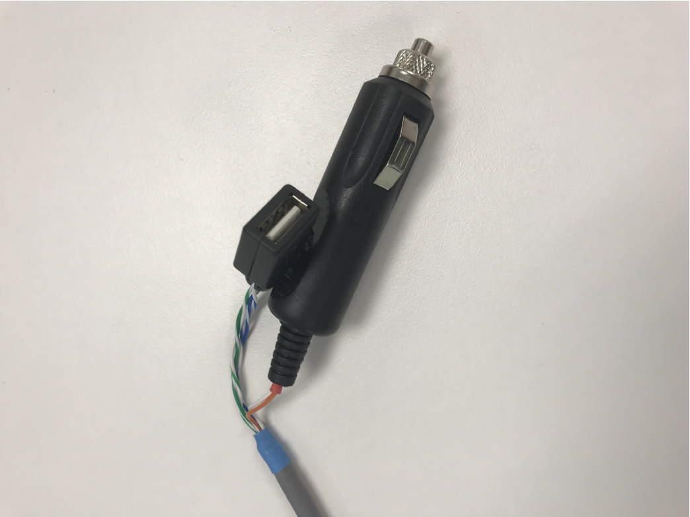

   Figure 1: Power connector

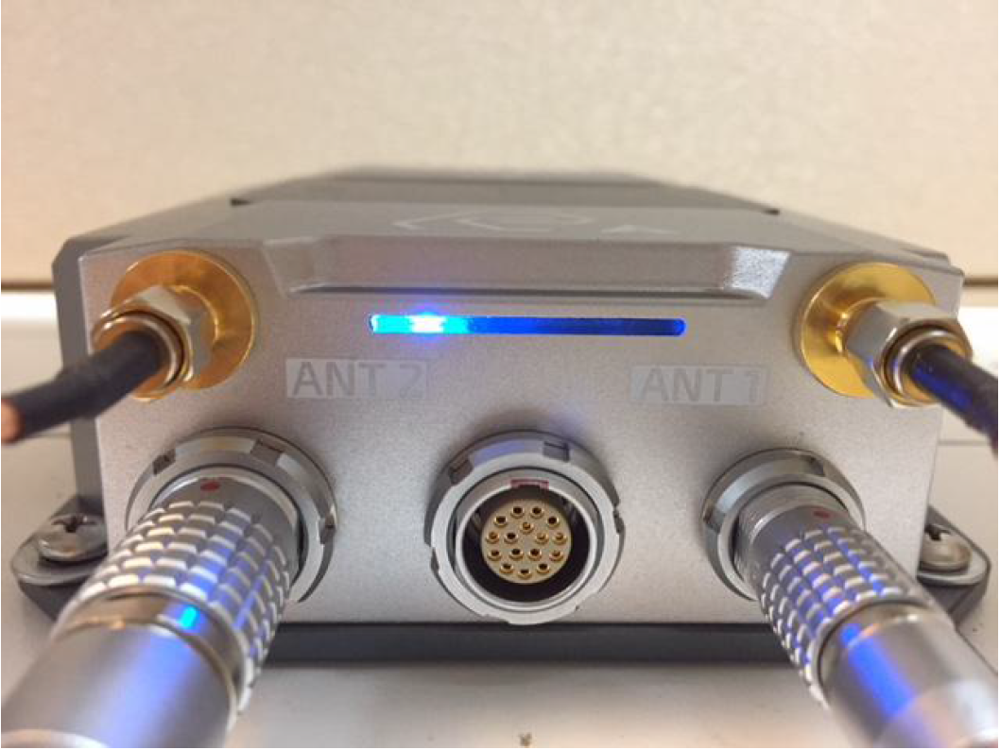

   Figure 2: Power light

3. Connection
------------------------

3.1 Serial Connection
~~~~~~~~~~~~~~~~~~~~~~~~~~~~~~~~~~~

The INS1000 system supports serial communication. To establish serial communication, use one Serial to USB cable to connect the COM-PORT of the data cable (shown in Figure 3) to your computer or other data receivers.

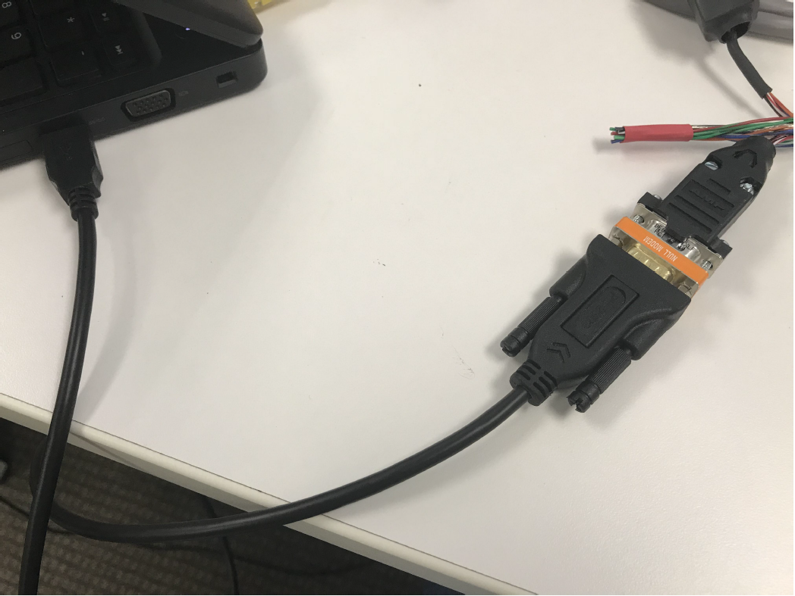

   Figure 3: Connect the serial usb to computer

To find the serial port, for Windows computer, users can use the steps below. For linux or Mac computers, use the equivalent steps.

- Disconnect the blue USB from your computer.
- Open the **Device Manager page** on your computer
- Connect the blue USB to your computer and check the **Ports** section to see which port is added.

The INS1000 system outputs multiple data messages. To control which messages are sent through serial connection, use the AceinnaNav Control Software (see section 5.1 in AceinnaNav Control Software User Manual), or send User Configuration Setup message to the system (see section 8.4 in INS1000 Reference Manual).

3.2 Ethernet Connection
~~~~~~~~~~~~~~~~~~~~~~~~~~~~~~~~~~~

The INS1000 system supports ethernet communication. To establish ethernet communication, there are two kinds of connection:

First, there is

- Direct connection: Connect an ethernet cable between the white connector of the data cable (shown in Figure 4) and a computer or other data receiver.

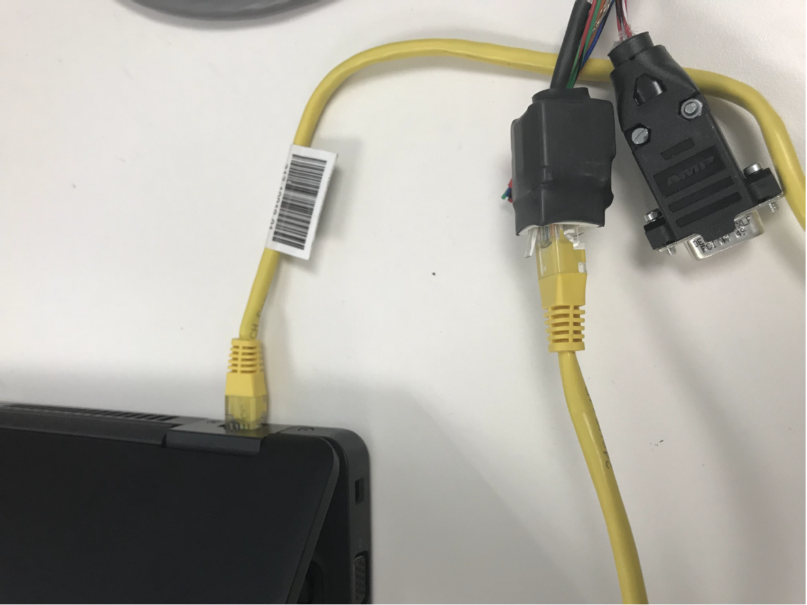

   Figure 4: Connect an ethernet cable between the ethernet connector and a computer

Users need to set the IP address of the computer or data receiver to 192.168.100.XXX. XXX can be any number from 2 to 254, except 97. The system’s IP address is 192.168.100.97. Data port is 8888.

- Connection with router: Connect an ethernet cable between the white connector of the data cable (shown in Figure 5) and a router, another cable between the router, and your computer (shown in Figure 6) or other data receiver.

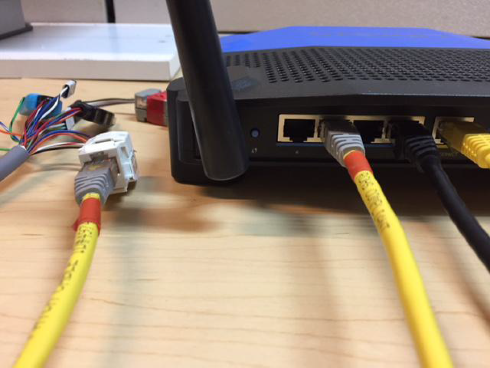

   Figure 5 Connect an ethernet cable between the ethernet connector and a router

   
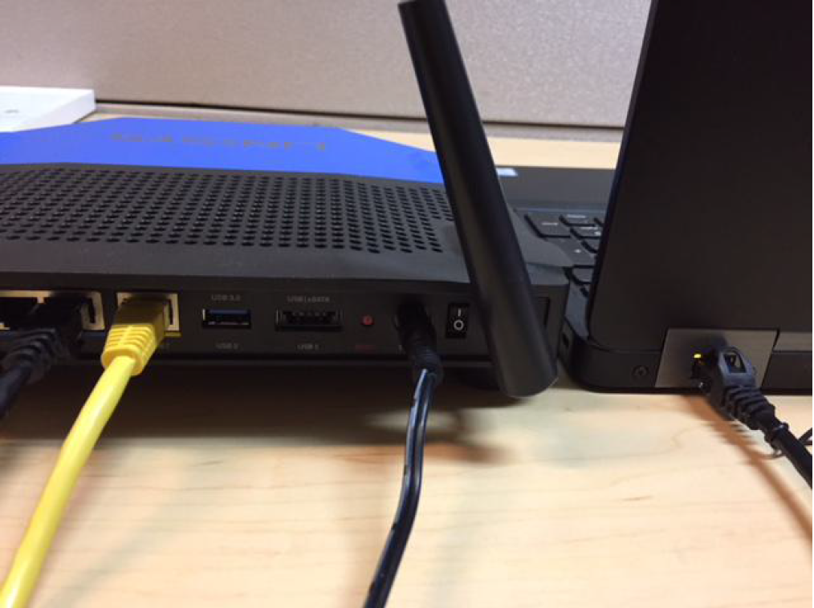

   Figure 6 Connect an ethernet cable between the router and a computer

To set up ethernet communication, users need to turn on DHCP of the ethenet interface on the computer. Users also need to retrieve the IP address from the INS1000 system using System IP Address Query message. The system will send back a System IP address response (see section 8.6 in INS1000 Reference Manual for query and response format). The data port is 8888.

To control which messages are sent through ethernet cable, use the AceinnaNav Control Software (see section 5.1 in AceinnaNav Control Software User Manual), or send User Configuration Setup message to the system (see section 8.4 in INS1000 Reference Manual).

4. Data Format
------------------------

All output data format are described in INS1000 Reference Manual.

The INS1000 system accepts input message through serial connection and Ethernet connection. All input data format can be found in section 7 and 8 in INS1000 Reference Manual.

5. RTK
------------------------

The INS1000 system supports Real-Time Kinematic (RTK) positioning. To turn on RTK mode, users need to do the followings:

- Connect the system to the Internet: Connect an ethernet cable between a router which can access the Internet, and the white connector of the data cable (shown in Figure 7).

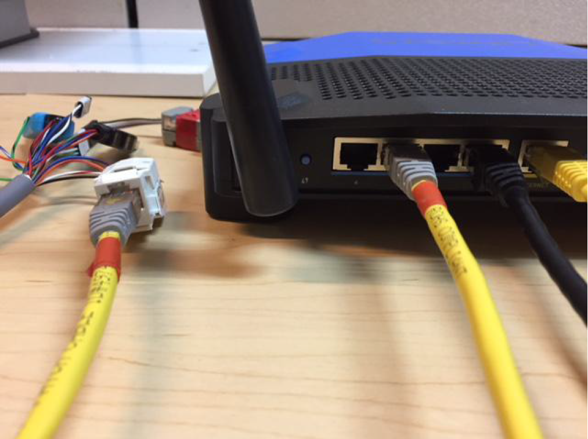

   Figure 7 Connect the system to a router

- Configure NTRIP client of the system: Use NTRIP client setting dialog of the AceinnaNav Control Software to set the system to use an available RTK base station. See section 6 in AceinnaNav Control Software User Manual about how to use NTRIP client setting dialog.

6. System Status
------------------------

Users can check the following to see if your system is working properly. The procedures below may need to use AceinnaNav Control Software to check the status of the system. To see system status in the software, users need to connect the blue USB to a computer, and then open the software and establish a serial connection. See section 2 and 3 in AceinnaNav Control Software User Manual about software installation and connection establishment.

- Check if the system is powered: Check if the light on the box is turned on. If it isn’t turned on, the system isn’t powered.

- Further check if subsystem is working: In the AceinnaNav Control Software, check if the IMU, GNSS, and PPS indicators blink green at the bottom-right corner (shown in Figure 8).

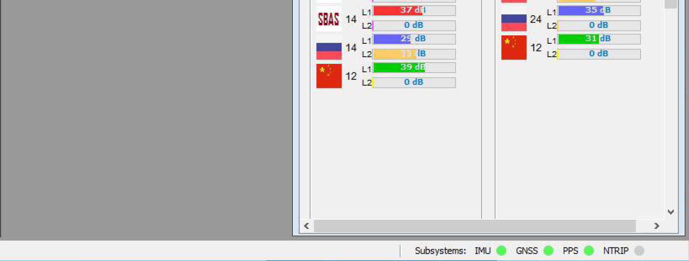

   Figure 8 Subsystem status indicators

- Check if attitude is coming: In the AceinnaNav Control Software, check if the Attitude Mode is fine in the Navigation Information dialog (shown in Figure 9).

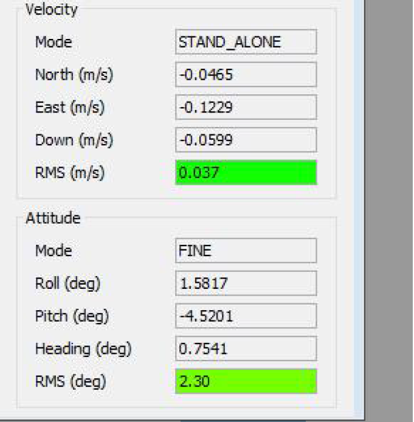

   Figure 9 Attitude Mode

If the Attitude Mode is invalid, place the system under open sky and check if satellite signal is enough with the signal panel of the software. Under open sky, there is usually 10 to 20 satellites for each antenna in the signal panel.

- If you are using RTK, check if the system is on RTK mode: In the AceinnaNav Control Software, check if the Postion Mode is RTK_FLOAT or RTK_FIXED (shown in Figure 10). Check if NTRIP indicator blink at the bottom-right corner (shown in Figure 11).

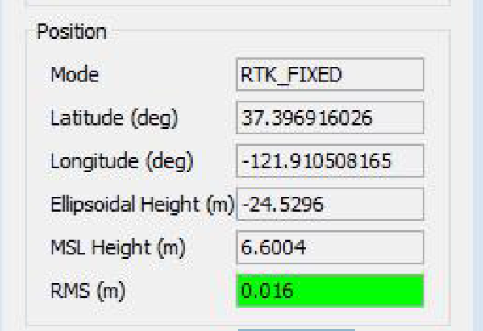

   Figure 10 RTK Mode

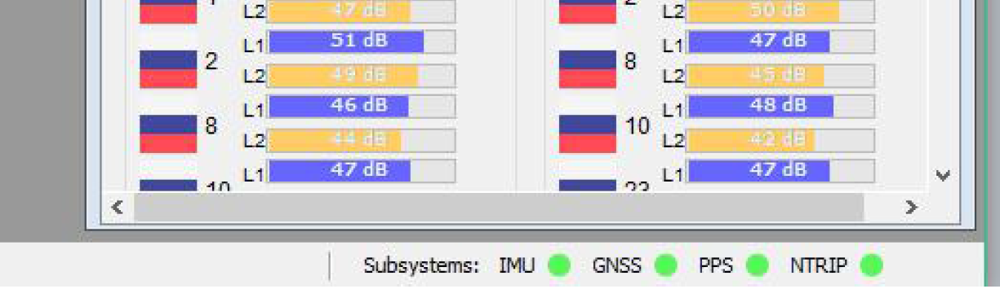

   Figure 11 NTRIP indicator

7. Interface Cable Pin Definition
-----------------------------------
The table below is the cable pin definition. Figure 12 is the sectional view of 19 position wiring cable.

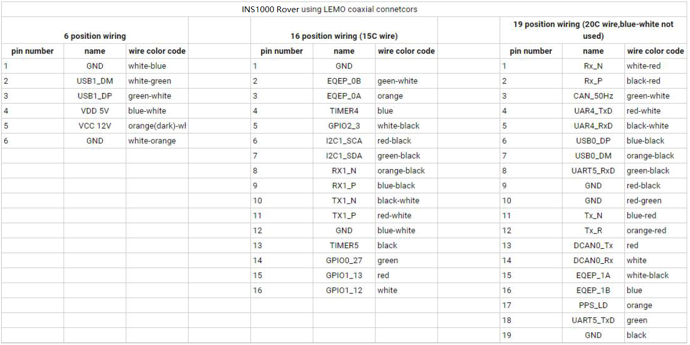

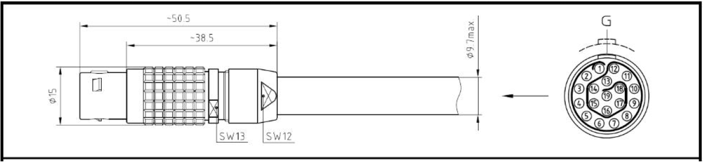

   Figure 12 Sectional View of 19 Position Wiring Cable