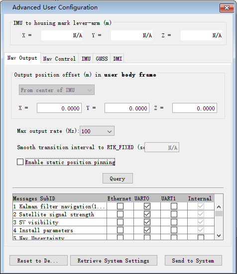
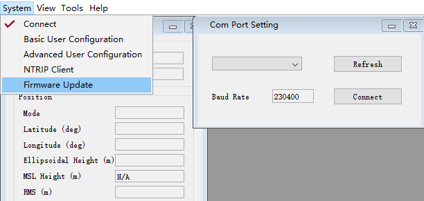
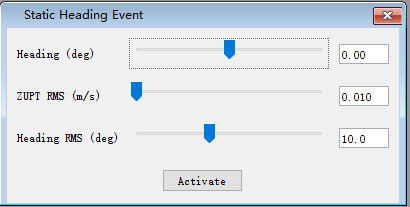

Set Up & Software Guide
=======================

.. contents:: Contents
    :local:

1. Introduction
----------------

This guide shows how to set up and install the INS1000 rover, and use the GUI. Please read it carefully.

AceinnaNav Control Software (ACS) is a graphical user interface for the AceinnaNav integrated navigation system. It displays continuous position, velocity, attitude, and trajectory information from the system. Additionally, it also provides tools to configure the system and log output data from the system.

2. Installation Guide
------------------------
AceinnaNav Control Software runs on Java Runtime Environment (JRE) 9. For JRE 9 download and setup, please refer to Oracle official website. To run the software, double-click the AceinnaNav.jar file.

Some PCs may not recognize the USB of the AceinnaNav system. The user needs to install the usb driver according to the system of the PC. The drivers are provided in the For Linux/For Mac/For Windows folders with the control software.

3. Connection
------------------------
Before connecting to the AceinnaNav system, make sure the system’s power is on. There will be a light indicating power. Check that the USB is plugged into the computer and the control software is installed in the computer.

To connect to the system, use the “Com Port Setting” dialog, shown in Figure 1. The user can reopen the dialog by choosing “System > Connect” menu if it is closed.

To choose a port, first click the [Refresh] button to get the list of available ports and then select a port from the drop-down list (shown in Figure 2). The baud rate is fixed as 230400 now. After all are set, click the [Connect] button. Please try another port if the message “Cannot open the port” shows up.

.. figure:: media/rover/Connection_dialog.png
   :scale: 100 %
   :align: center

   Figure 1: Connection dialog

   Figure 2: Port selection

4. View
------------------------

4.1. Subsystems Status
~~~~~~~~~~~~~~~~~~~~~~~~~~~~~~~~~~~

At the bottom-right corner of the interface, there are four indicators for the status of IMU, GNSS, PPS and NTRIP subsystems shown in Figure 3. A flashing green circle means the subsystem is on. Normally, IMU and GNSS turn on right after the power is supplied, and PPS turns on after the time is resolved with GNSS measurements. Users may be able to see the navigation data output with enough satellite data. NTRIP indicator will be on whenever the system receives information from the base station. The user can use these four indicators to see if the system is working properly or not.

   Figure 3: Subsystems status indicators

4.2. Product ID and Engine Version
~~~~~~~~~~~~~~~~~~~~~~~~~~~~~~~~~~~

At the bottom-left corner of the interface, the user can see the product ID and the engine version of the system as shown in Figure 4.

   Figure 4: Product ID and engine version

4.3. Navigation Information
~~~~~~~~~~~~~~~~~~~~~~~~~~~~~~~~~~~

Navigation information dialog (shown in Figure 5) displays the Kalman Filter navigation message from the system, including time, position, velocity and attitude information. This message comes in 1 Hz synchronized with the GNSS measurements. For more details about the message, please refer to AceinnaNav Reference Manual. The user can reopen the dialog in “View > Navigation Info” menu if it is closed.

.. figure:: media/rover/Navigation_information_dialog.png
   :scale: 100 %
   :align: center

   Figure 5: Navigation information dialog

4.4. Satellites Signal Status 
~~~~~~~~~~~~~~~~~~~~~~~~~~~~~~~~~~~

GNSS signal status dialog (shown in Figure 6) displays the satellite signal strength information obtained from the GNSS observables. For each satellite it shows the satellite system, unique satellite number, and the L1/L2 signal strength. For more details about the message, please refer to AceinnaNav Reference Manual. The user can reopen the dialog in “System -> SV Signal” menu if it’s closed.

   Figure 6: GNSS signal status

4.5. IMU data
~~~~~~~~~~~~~~~~~~~~~~~~~~~~~~~~~~~

IMU data dialog (show in Figure 7) displays the current acceleration and rotation rate in polyline graphs. If the IMU data doesn’t show up, the user can click the [Turn on IMU data] button to enable the output of the raw IMU data.

The direction of the axes of an IMU can be identified using the accelerometer signal. When an accelerometer is placed in upward direction on a level surface, its output should be approximately 9.8 m/s2. On the other hand, if it is place in downward direction, the output should be -9.8m/s2. The positive direction of all three axes of an IMU can be identified this way.

4.6. Trajectory
~~~~~~~~~~~~~~~~~~~~~~~~~~~~~~~~~~~

Trajectory view dialog (shown in Figure 8) displays the current trajectory. The software starts recording the trajectory when the dialog is open. When the dialog is closed, the trajectory will be cleared.

.. figure:: media/rover/IMU_data_graphs.png
   :scale: 100 %
   :align: center

   Figure 7: IMU data graphs

.. figure:: media/rover/Trajectory_view_dialog.png
   :scale: 100 %
   :align: center

   Figure 8: Trajectory view dialog

5. User Configuration
------------------------

The user can control the behavior of the navigator using the control software. After connecting to the system, choose “System > User Configure” from the menu (shown in Figure 9).

   Figure 9: User configuration menu

5.1. Output Control
~~~~~~~~~~~~~~~~~~~~~~~~~~~~

The user can do the followings in the navigation output control tab shown in Figure 10:

- Specify the navigation output position. The user can choose from the center of the IMU or the cross-mark on top of the IMU housing.
- If the static position pinning is enabled, the system will output a fixed position during a static period detected by the GNSS. Note that there is a chance that the system can miss the detection if the signal quality becomes weak.
- Choose ICD messages for output. Pay specific attention when choosing high-rate outputs as outputting multiple high-rate messages can saturate the communication port.
- Check the current output position offset and whether the static position pinning is enabled in the system with the [Query] button.

   Figure 10: Navigation output control tab

5.2. Navigation Control
~~~~~~~~~~~~~~~~~~~~~~~~~~~~

The user can control the behavior of the navigation in the tab shown in Figure 11.

The user can enable initialization of heading from the GNSS velocity. To activate this option, the x-axis of the user body frame must be aligned with the forward direction of the vehicle. See “Install Parameters” tab to set the transformation from the IMU frame to the user body frame. Also, the minimum speed for the heading initialization can be specified.

The navigation error keeps growing if no aiding source is available. The system will stop outputting the navigation results if the dead-reckoning time exceeds the maximum that the user specifies.

.. figure:: media/rover/Navigation_control_tab.png
   :scale: 100 %
   :align: center

   Figure 11: Navigation control tab

5.3. IMU
~~~~~~~~~~~~~~~~~~~~~~~~~~~~

In the “IMU” tab (shown in Figure 12), the user can do the followings :

- Specify the matrix for the transformation from the IMU frame to the user body frame. Please refer to the detailed  `Transformation Matrix <ref_outline.html#the-imu-frame-and-the-body-frame>`_ in reference manual.

- Check the current transformation matrix of the system with the [Query IMU matrix] button.

   Figure 12: IMU configuration tab

5.4. GNSS
~~~~~~~~~~~~~~~~~~~~~~~~~~~~

Note that the lever-arms to be entered shall be in meters from the cross-mark on top of the IMU housing to each antenna’s phase center in the user body frame.

In the “GNSS” tab (shown in Figure 13), the user can do the followings :

- Set the lever-arms of the GNSS antennas. Note that the lever-arms to be entered shall be in meters from the cross-mark on top of the IMU housing to the antennas phase center in the user body frame.
- Set the separation between two GNSS antennas, which will aid the carrier-phase ambiguity resolution for the attitude determination.
- Check the current antenna lever-arms of the system with the [Query lever-arm] button.
- Check the antenna separation of the system with the [Query] button.

.. figure:: media/rover/GNSS_configuration_tab.png
   :scale: 100 %
   :align: center

   Figure 13: GNSS configuration tab

6. NTRIP Client 
------------------------

The user can configure the NTRIP client settings using the NTRIP Client settings dialog (shown in Figure 14). To open the dialog, choose “System > NTRIP Client” from the menu shown in Figure 15. After all information is entered, press the [Set] button to configure the NTRIP client information. After seeing a message box with “Configuration finished”, restart the system to use the new NTRIP client settings. The user can also [Query] the current NTRIP client settings of the system. To get the settings, click the [Query] button in the NTRIP Client dialog and the information will show up.

If user use "rtk2go.com" as server, the default password is "BETATEST".

Previous NTRIP settings will be stored in the table below. The user can reuse previous settings by double-clicking that particular setting.

.. figure:: media/rover/NTRIP_client_settings_dialog.png
   :scale: 100 %
   :align: center

   Figure 14: NTRIP client settings dialog

   Figure 15: NTRIP Client menu

7. Firmware Update 
------------------------

The user can update the firmware of the system by uploading the latest firmware file provided by Aceinna. To upload the firmware file, choose “System > Firmware Update” (shown in Figure 16). In the file selection dialog shown in Figure 17, browse the firmware file and click the [Upload] button. Firmware file upload will take a few minutes. Please wait until the “Firmware Update finished” message shows up. The user can see the current progress at the bottom. To cancel the firmware update, close the “Upload File” dialog.

   Figure 16: Firmware update menu

.. figure:: media/rover/Firmware_file_selection.png
   :scale: 100 %
   :align: center

   Figure 17: Firmware file selection

8. Tools
------------------------

The control software provides tools to log and decode output data from the system.

8.1. Log Data
~~~~~~~~~~~~~~~~~~~~~~~~~~~~

The user can log binary data from the system using the Export dialog by choosing the “Tools > Export” menu.

Before logging, make sure that the software has opened the right port and the status of the subsystems IMU, GNSS, and PPS are on at the bottom-right hand corner.

To choose a folder to save the data, click the [Browse] button. To log the data, click [Start Export] button in Figure 18. To finish logging, click the [Stop Export] button then a message about the saved data file name will show up. The file name convention is yyyy_mm_dd_HH_MM_SS.dat, e.g. 2018_02_09_02_36_34.dat.

.. figure:: media/rover/Data_export_dialog.png
   :scale: 100 %
   :align: center

   Figure 18: Data export dialog

8.2. Decode Data
~~~~~~~~~~~~~~~~~~~~~~~~~~~~

The user can decode the logged data using the decoder provided by the control software. The decoder (shown in Figure 19) is available by choosing “Tools > Decode” menu. To decode a file, use the [Browse] button to find the file for decoding and then press the [Decode] button. Usually, the decode takes a few seconds to finish. For a large file, it may take up to a minute. Please wait until it is finished.

The decoded results will be stored in the same folder as the data files and consist of three files: *kf.txt, *nav.txt and *.kml. The *kf.txt file stores Kalman Filter message. The *nav.txt file stores the high-rate compact navigation messages. Lastly,*.kml file stores the trajectory that can be viewed in Google Earth software.

The user can choose to convert the attitude quaternion to roll, pitch, and heading using the “Attitude in roll, pitch, heading” check box. For more details about the conversion, please refer to the AceinnaNav Refence Manual.

The user can also set the output decimation rate to adjust the density of the points in the KML trajectory file. For example, entering “30” makes the decoder output to the KML file at every 30 points.

.. figure:: media/rover/Data_decode_dialog.png
   :scale: 100 %
   :align: center

   Figure 19: Data decode dialog

8.3. Zero Velocity Update
~~~~~~~~~~~~~~~~~~~~~~~~~~~~

The user can send Zero Velocity Update (ZUPT) messages when the vehicle is not moving. Specifically, this will improve the navigation system where the GNSS signal is degraded. The user can set and send this message using the Zero Velocity Update dialog at the “Tools > Zero Velocity Update” menu (shown in Figure 20). After setting the horizontal and vertical standard deviation, click [Activate] button to keep sending the message containing these two values. Click [Deactivate] button to stop sending. If both values are set to zero, the message cannot be sent.

.. figure:: media/rover/Zero_Velocity_Update_dialog.png
   :scale: 100 %
   :align: center

   Figure 20: Zero Velocity Update dialog

8.4. Static Heading Event
~~~~~~~~~~~~~~~~~~~~~~~~~~~~

The user can send a static heading event message to initialize the inertial navigator when the position is available from the GNSS receivers but the heading initialization has difficulties due to degraded GNSS signals. To send the message, the user can use the Static Heading Event dialog at the “Tools > Static Heading Event” menu (shown in Figure 21). After setting the heading, ZUPT RMS, and heading RMS, click [Activate] button to keep sending the message containing these values. Click [Deactivate] button to stop sending. If both of the ZUPT RMS, and heading RMS are set to zero, the message cannot be sent.

   Figure 21: Static Heading Event dialog

9. Internal Data Download
------------------------

The system internally stores the raw sensor data and navigation data, of which the naming convention is as follows:

- Raw sensor data: raw_wwww_ssssss.dat
- Navigation data: nav_wwww_ssssss.dat

Where “wwww” and “ssssss” correspond to the GPS week number and seconds of the week at the start of the mission.

Users can download the internal data using any ftp client.

